# Prism Core — High-Level Design

How we turn messy documents into structured data you can actually query — and what happens when the model is wrong.

If you only skim one doc in this repo, make it this one. Deeper ADRs live in [`decisions.md`](decisions.md); the project-round narrative is in [`SUBMISSION.md`](SUBMISSION.md); papers we studied are in [`RESEARCH.md`](RESEARCH.md).

---

## What we’re solving

Most “document AI” demos do this:

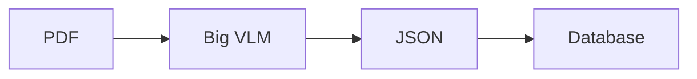

That falls apart on real financial PDFs: columns get read in the wrong order, tables shift indexes, numbers look fine as JSON but break basic accounting, and if you write Postgres + Neo4j + Qdrant in one shot you get split-brain when one store dies.

We scoped the problem more narrowly:

> Extract trustworthy rows from messy business docs, refuse to promote junk, and let an analyst ask questions against what actually landed.

Not “chat with any PDF on earth.” Finance-ish documents first. Depth over coverage.

---

## The bet

Accuracy isn’t one clever prompt. It’s a pipeline. Each stage kills a specific failure mode, then we query the structured result — not the pixels.

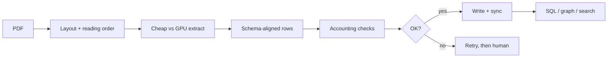

---

## Big picture

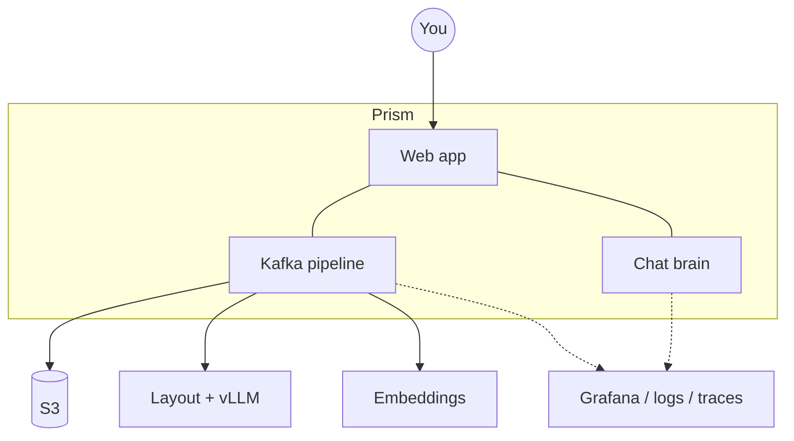

Someone uploads (or S3 fires an event). Work moves through Kafka. The UI is for watching the queue, fixing what we can’t, and asking questions afterward.

---

## How the boxes fit together

We split the work on purpose. Go handles ingress and triage. Python owns CV and LLM alignment. Chat is its own service so a GPU OOM doesn’t take down Q&A.

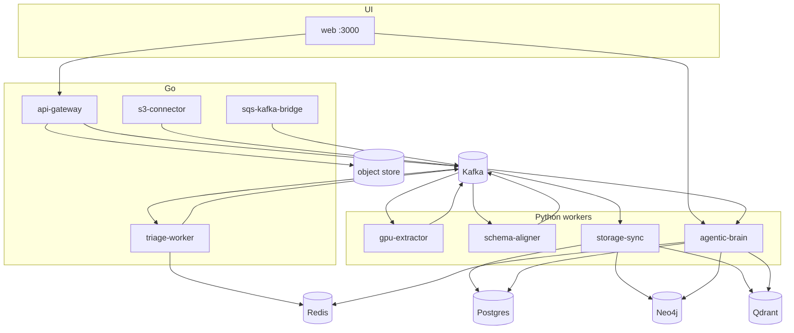

Rough stages left to right:

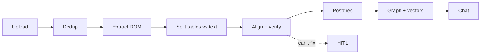

### Services at a glance

| Service | Role |
|---------|------|
| `api-gateway` | Stream upload → S3 + `IngestEvent` to Kafka |
| `sqs-kafka-bridge` | SQS/ElasticMQ → `s3_discovery_events` |
| `s3-connector` | Discovery consume → dedupe → gateway upload |
| `triage-worker` | Exact-hash dedupe + GPU route / DLQ |
| `gpu-extractor` | Layout + element-level OCR/VLM → `DocumentDOM` |
| `schema-aligner` | Instructor structured align + critics + Reflexion |
| `storage-sync` | Bifurcation, Postgres upserts, Qdrant, views, CDC observer |
| `agentic-brain` | LangGraph chat + deterministic `/task` agents |
| `web-dashboard` | Operator UI (chat, docs, HITL, DLQ, agents) |

Per-service ADRs: `apps/*/decision.md`. Infra sidecars (ElasticMQ, S3Mock, Cube, Connect, Grafana): [`infra/`](infra/).

### Data plane

- **Postgres** — `extracted_tables` JSONB + registry-driven `view_*` for BI/Cube  
- **Qdrant** — chunk embeddings for RAG  
- **Neo4j** — graph extraction / Cypher for the brain  
- **Kafka** — at-least-once backbone between workers  
- **Redis** — locks, etag/hash caches, triage fail counters  

---

## A document’s life

### When things go well

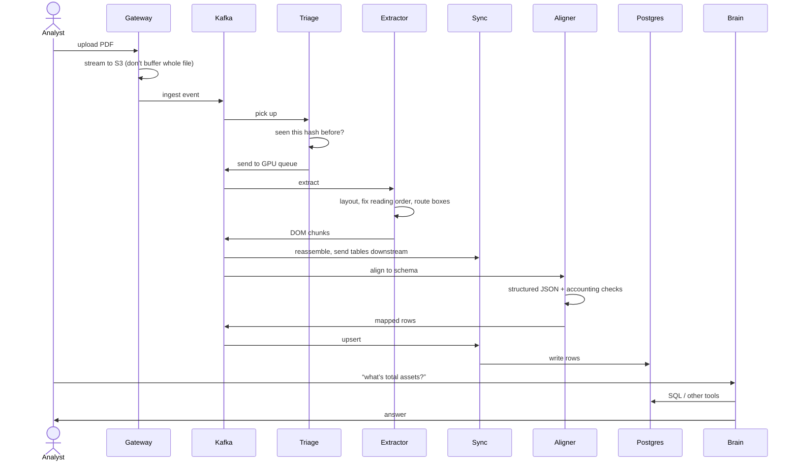

### When the numbers don’t add up

We don’t immediately dump on a human. First we try to fix it ourselves.

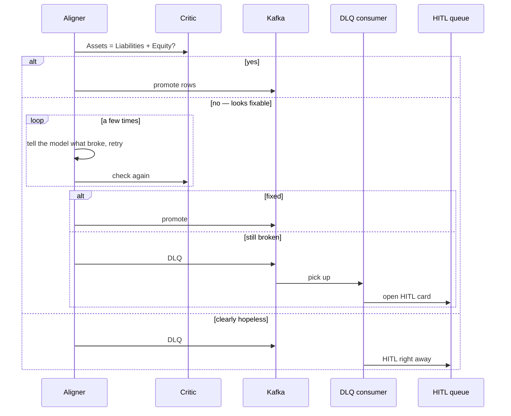

So: **auto-repair first, HITL when we give up** (or when retrying would be stupid — empty OCR, unknown table, etc.).

---

## The parts we spent the most time on

### Upload and triage

Gateway streams the file to object storage so a 500MB PDF doesn’t blow RAM. Triage checks Redis for an exact hash so we don’t burn GPU on the same file twice. Near-duplicate / “version 2” handling sits behind that.

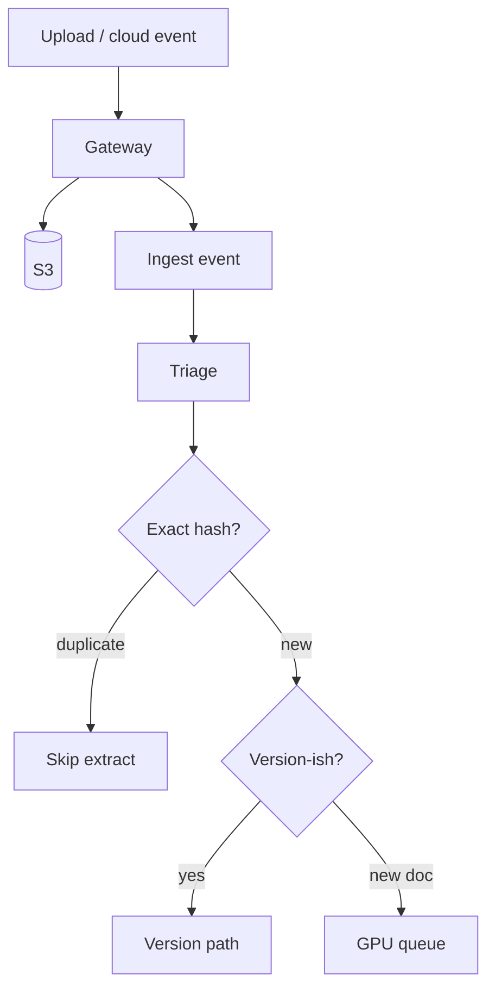

### Extraction (this is where most demos cheat)

We don’t OCR the whole page with one giant model.

1. Detect boxes (Docling layout, PyMuPDF fallback).  
2. Sort into reading order with a simple Y-clustering pass (ε ≈ 15px), then X within a line — so two-column statements don’t get mashed.  
3. Route each box: plain text → PyMuPDF; forms/KV → small VLM; tables → heavier VLM with guided JSON.  
4. Batch GPU work so the card stays busy without waiting forever for a full batch.

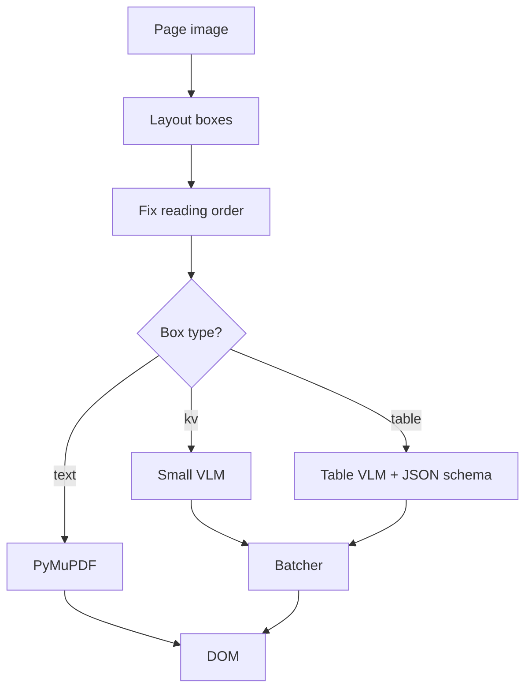

Big PDFs get chunked by pages; we carry section headers across chunks so a table on page 40 still knows whose statement it is.

### Aligning to a schema

Classify what table this is, notice if it’s pivoted, build a Pydantic model from our registry (and inject entity/period/currency/scale), then extract in small row chunks so we don’t get the classic “column A has 9 values, column B has 10” mess.

Then **declarative critics** run (balance-sheet identity, P&L chains, cash-flow rollup, bank running balance, invoice totals, …). Hard failures enter a bounded **Reflexion** repair loop with the critic result stuffed back into the prompt. After that budget, DLQ → HITL. Passing rows can still promote even if sibling rows failed.

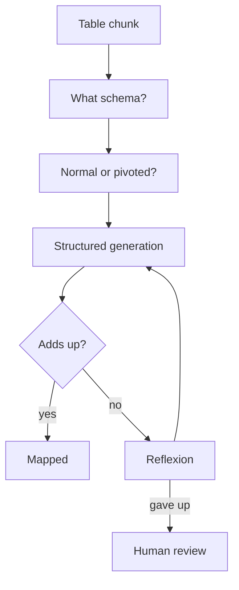

Honest limit: critics check **internal consistency**. They won’t catch “the PDF said 700 but we read 70” if 70 still makes the equation work. That’s why HITL and goldens exist.

### Storing without lying to ourselves

Tables go through the aligner. Prose gets embedded straight to Qdrant. Aligned rows land in Postgres with a boring but important key: `(document_id, node_id, row_index)` and upsert on conflict. Kafka can deliver twice; we won’t double-insert garbage.

Neo4j and Qdrant catch up via sync/CDC. If they’re down, offsets wait. We accepted eventual consistency over fake distributed transactions.

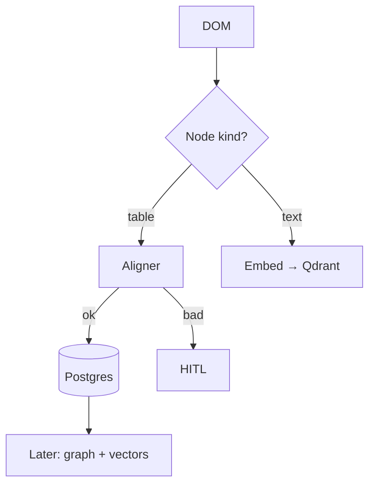

### Chat

After data is in, the brain is a small LangGraph: look at the question, maybe hit SQL, Cypher, and/or vector search in parallel, retry a couple times if the query blows up, then synthesize. Tenant filters get injected by our tools — we don’t ask the model to remember `tenant_id`.

Background “agents” in the UI are a fixed registry (export, validate, …), not “write Python against prod.”

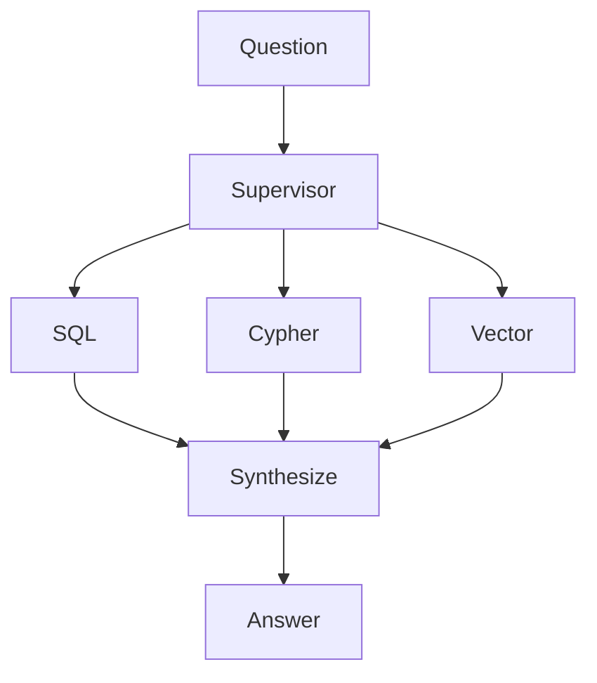

---

## Data, briefly

Shared protobufs (`IngestEvent`, `DocumentDOM`) keep Go and Python honest.

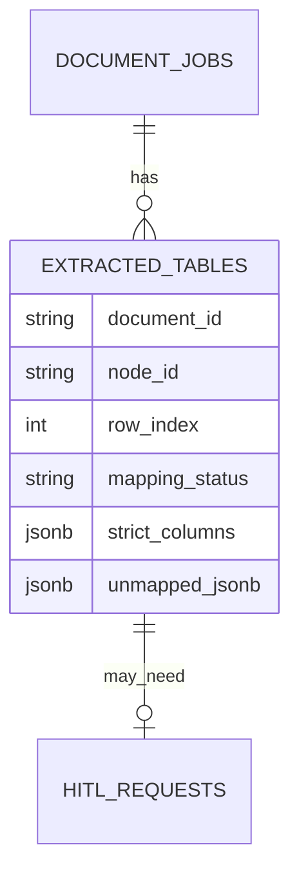

`strict_columns` is the clean row. `unmapped_jsonb` holds drift, critic errors, reflexion history — useful when a human opens the card.

---

## Making it operable

Async pipelines are miserable to debug without correlation. We stamp OTel context across Kafka and put `trace_id` on JSON logs so Grafana can join Loki and Tempo.

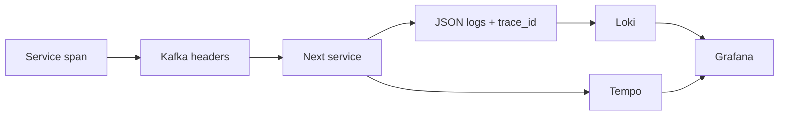

Health endpoints, retries with backoff, Alembic migrations — unglamorous, but it’s how you ship this without living in `docker logs`.

---

## Scale (without the slideware)

Can this hold **100k+ documents**? As a **corpus**, yes — that’s rows, vectors, and Kafka replay, not a rewrite. As a **firehose**, you’re limited by GPUs and alignment, not the upload API. Scale by adding partitions and extractor/aligner replicas; keep vLLM centralized so every worker doesn’t load a 7B model.

Local compose is one replica of everything. That’s fine for a demo. Don’t pretend it’s a load test.

Stuff I’d watch in production: Kafka lag, time from upload to mapped/HITL, how often critics fire, GPU time per doc, chat latency once the corpus is big.

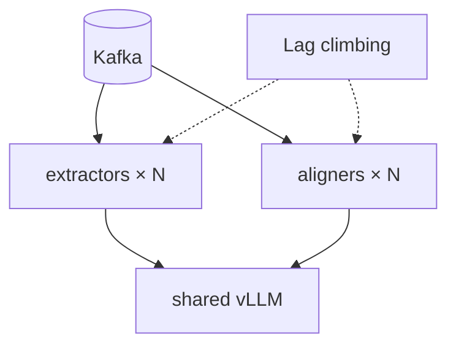

---

## What we cut on purpose

- Full SSO — `tenant_id` is everywhere; login product comes later  
- Supporting every document type — we’d rather be sharp on statements/invoices  
- “Always call GPT-4o” — cost and nondeterminism fight the goal  
- Pretty marketing UI — queue, HITL, and chat matter more  

---

## If you only remember one diagram

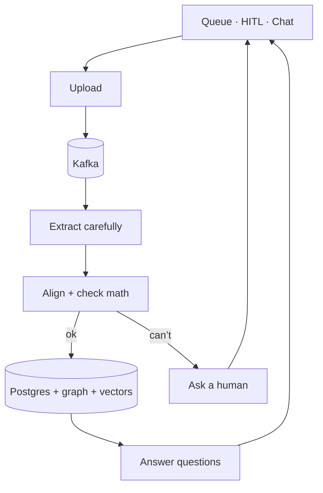

That’s the system: careful extraction, schema + accounting gates, honest escalation, then query what you trust.
