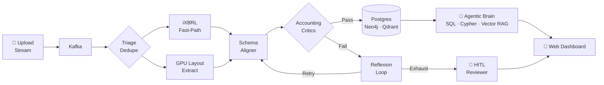

<p align="center">
  
</p>

<h1 align="center">Prism Core</h1>

<p align="center">
  <strong>Agentic document intelligence platform — layout-aware extraction, declarative accounting critics, real-time HITL review, and tri-modal RAG.</strong>
</p>

<p align="center">
  
  
  
  
  
  
  
</p>

<p align="center">
  <a href="architecture.md">📐 Architecture</a> ·
  <a href="decisions.md">🗂 Decisions</a> ·
  <a href="research.md">📚 Research</a> ·
  <a href="infra/README.md">🔧 Infra</a> ·
  <a href="packages/contracts/README.md">📦 Contracts</a>
</p>

---

## ⚡ Quick Start

```bash
# 1. Clone & configure
cp .env.example .env

# 2. Launch the full product stack
make up
```

| Surface | URL |
|---|---|
| 🖥 Web Dashboard | http://localhost:3000 |
| 🚪 API Gateway | http://localhost:8080 |
| 🧠 Agentic Brain API | http://localhost:8001 |

---

## 🔭 The Vision

Most document AI demos upload a PDF, call a monolithic vision model, stash raw JSON, and provide a generic chat box. That approach fails on real business filings: columns quietly shift, numbers break accounting rules, and models guess when they should escalate.

Prism Core defines success as **structured data you can defend — and an explicit path when you can't**:

- ✅ **In scope:** Zero-copy upload streaming, dual-path ingestion (iXBRL fast-path vs. visual layout VLM), schema alignment with declarative accounting critics, multi-store sync, real-time HITL escalation, and tri-modal agentic RAG.
- 🚫 **Out of scope (on purpose):** Generic chat with every document on Earth. Prism Core focuses deeply on complex financial statements, annual reports, invoices, and receipts.

---

## 🏗 Pipeline



---

## ✨ Feature Highlights

<details>
<summary><strong>🔀 Dual Ingestion Engine & Fast-Path Parsing</strong></summary>

Fast-path iXBRL HTML tag parser and Indian MCA / BSE XBRL XML parser bypass VLM extraction for structured digital filings with near 100% precision. Only scanned / image-heavy documents fall through to the GPU visual extraction path.

- `apps/schema-aligner/src/core/ixbrl_parser.py` — SEC EDGAR iXBRL
- `apps/schema-aligner/src/core/mca_xbrl_parser.py` — Indian MCA / BSE XBRL

</details>

<details>
<summary><strong>🧱 Layout-Aware Reading Order & Column Clustering</strong></summary>

Multi-column pages are clustered along the 1D Y-axis (ε ≈ 15px) and sorted by X-coordinates before passing to LLMs/VLMs, preventing text mashing across columns. Text boxes use PyMuPDF; only hard visual table regions hit VLMs.

</details>

<details>
<summary><strong>📐 Declarative Accounting Critics & Fail-Closed Safety</strong></summary>

Hard mathematical verification gates every structured record before it lands in Postgres:

| Rule | Formula |
|---|---|
| Balance Sheet | `Assets = Liabilities + Equity` |
| Income Statement | `PAT = PBT − Tax` |
| Cash Flow | Rollup reconciliation |
| Bank Statement | Running balance check |

Syntactically valid JSON that violates these rules **fails closed** and escalates — it never silently enters the database.

</details>

<details>
<summary><strong>🔁 Reflexion Loop & Bounded Auto-Repair</strong></summary>

When critics fail, a bounded Reflexion loop feeds the exact validation error back into the model's context for auto-repair. If retries expire or fail terminally, the record is escalated in real time via SSE to the HITL Reviewer.

</details>

<details>
<summary><strong>🙋 Real-Time HITL as a Product Feature</strong></summary>

Non-standard schedules never block the ingest queue. Operators see live escalation cards in the Web Dashboard and can:

- **Approve** with corrected field values
- **Approve as Generic Table** — persists to a `generic_tables` store
- **Divert to RAG** — routes the node to Qdrant for semantic search instead

</details>

<details>
<summary><strong>🌏 Multi-Jurisdiction Engine (US-GAAP + Ind AS)</strong></summary>

Native dual support for **SEC 10-K (US-GAAP)** and **Indian Annual Reports (Ind AS / Schedule III)** with automated jurisdiction detection. Features:

- 110+ domain aliases (*PAT, PBT, Finance Costs, Other Equity, CWIP*)
- Scale exclusion protection for per-share metrics (EPS, share counts)
- Native Crore (10⁷), Lakh (10⁵), and Indian 2-digit comma grouping (`1,00,00,000`)
- Cross-page table stitching and multi-period unpivoting (`2024 / 2023 / 2022`)

</details>

<details>
<summary><strong>🧠 Tri-Modal Agentic RAG</strong></summary>

The Agentic Brain runs a LangGraph supervisor that routes queries across three modalities simultaneously:

| Modality | Store | Best For |
|---|---|---|
| 🗄 SQL | Postgres (Cube Semantic Layer) | Structured financial KPIs, ratios, time-series |
| 🕸 Cypher | Neo4j | Corporate relationship graphs, auditor networks, subsidiaries |
| 🔍 Vector | Qdrant (bge-small-en-v1.5 + reranker) | Footnote disclosures, qualitative risk language |

Four specialized **AI Employee** personas operate over the same tri-modal stack: *Forensic Accounting Auditor*, *Regulatory Compliance Officer*, *Credit Risk Analyst*, and *Financial Research Analyst*.

</details>

<details>
<summary><strong>📡 CDC & Kafka Decoupling</strong></summary>

Idempotent upserts `(document_id, node_id, row_index)` land in Postgres first. Vector embeddings and graph triples catch up asynchronously via Kafka/CDC — no blocking write fan-out in the hot ingest path.

</details>

<details>
<summary><strong>🧬 Domain Adaptation Strategy (No Hallucination Fine-Tuning)</strong></summary>

Instead of pure LLM fine-tuning (which risks memorizing numbers), Prism Core uses:

1. **Three-Tier Extraction Stack** — compute is matched to content complexity, not applied uniformly:
   - **PyMuPDF** (CPU) — digitally encoded text, prose, headings extracted for free from the PDF text layer
   - **SmolDocling-256M / Docling** (moderate GPU) — layout detection, reading order, and document DOM construction for structural context
   - **PaddleOCR-VL** (heavy GPU) — complex financial table grids and multi-header tables; only invoked for hard visual regions where the other two tiers fall short
2. **Taxonomy & Schema Fine-Tuning** — Registry aligned with US-GAAP and Ind AS / Schedule III, with 110+ domain aliases covering financial terminology across jurisdictions.
3. **Guided Decoding** — Strict Pydantic JSON schema constraints during LLM decoding, guaranteeing 100% structural precision on unseen filings.

</details>

---

## 🗂 Repository Layout

<details>
<summary><strong>View full repo tree</strong></summary>

```text
apps/
  api-gateway/        Go   — Zero-copy upload streaming edge server
  sqs-kafka-bridge/   Go   — AWS SQS/ElasticMQ → Kafka bridge worker
  s3-connector/       Go   — S3 bucket notification consumer & deduplicator
  triage-worker/      Go   — Redis exact-hash deduplication worker
  gpu-extractor/      Py   — RT-DETR layout detection & VLM extraction worker
  schema-aligner/     Py   — Instructor alignment, iXBRL fast-paths, accounting critics
  storage-sync/       Py   — Bifurcation engine, Postgres upserts, Neo4j UNWIND, Qdrant
  agentic-brain/      Py   — LangGraph tri-modal RAG chat & autonomous agent runner
  web-dashboard/      TS   — Next.js 14 operator interface (chat, queue, HITL, agents)
packages/contracts/         Protobuf schemas & Buf codegen (IngestEvent, DocumentDOM)
infra/                      Sidecar compose, Cube schemas, OTel / Grafana stack
docker-compose.yml          Canonical product stack
Makefile                    make up · make down · make test
.env.example                Environment variable template
```

</details>

---

## 🔌 Service Port Reference

<details>
<summary><strong>View all ports</strong></summary>

| Service | Port | Description |
|---|---|---|
| Web Dashboard | `3000` | Operator UI — queue, HITL cards, tri-modal chat, agent list |
| API Gateway | `8080` | Go ingress — zero-copy upload streaming |
| Agentic Brain | `8001` | LangGraph chat API + `/task` agent runner |
| TEI Embeddings | `8085` | HuggingFace TEI (`bge-small-en-v1.5`) |
| TEI Reranker | `8086` | HuggingFace Cross-Encoder (`bge-reranker-base`) |
| Cube BI Engine | `4000` / `4001` | Semantic data model & REST/SQL API |
| Postgres | `5432` | Primary relational store |
| Kafka / Zookeeper | `9092` / `2181` | Async event backbone |
| Redis | `6379` | Hash dedup cache & triage retry state |
| Neo4j | `7474` / `7687` | Entity-relationship graph database |
| Qdrant | `6333` / `6334` | Dense vector search engine |

</details>

---

## 🧪 Testing

<details>
<summary><strong>Run all test suites</strong></summary>

```bash
# Go microservices
cd apps/api-gateway      && go test ./...
cd apps/triage-worker    && go test ./...
cd apps/s3-connector     && go test ./...
cd apps/sqs-kafka-bridge && go test ./...

# Python microservices
cd apps/schema-aligner && poetry run pytest
cd apps/storage-sync   && poetry run pytest
cd apps/agentic-brain  && poetry run pytest
cd apps/gpu-extractor  && poetry run pytest

# Next.js dashboard
cd apps/web-dashboard && npm test -- --watchAll=false
```

Goldens: `apps/schema-aligner/evals/golden/`

</details>

---

## 📈 Horizontal Scalability

<details>
<summary><strong>Scaling notes</strong></summary>

- **Stateless Edge Streaming** — `api-gateway` streams uploads directly to object storage, enabling stateless L7 load balancing with no memory buffering.
- **Kafka Partition-Keyed Workers** — Scale ingest capacity by adding partitions and replicas:
  ```bash
  docker-compose up --scale gpu-extractor=4 --scale schema-aligner=8
  ```
- **Decoupled Model Sidecars** — vLLM and TEI run as shared sidecars; worker containers scale on cheap CPU nodes without duplicating VRAM weights.
- **Stateless Task Claiming** — Agentic Brain agents claim jobs via `FOR UPDATE SKIP LOCKED` — no Redis locks needed.
- **OTel End-to-End Tracing** — Trace context propagated through Kafka headers across Go and Python into Grafana (Loki + Tempo).
- **Alembic Migrations** — Relational schema managed via `apps/storage-sync/alembic`.

</details>

---

## 🛠 Prerequisites

| Requirement | Version |
|---|---|
| Docker + Docker Compose v2 | latest |
| Go | 1.25+ |
| Python + Poetry | 3.10 – 3.12 |
| Node.js | 20+ |
| GPU | Optional (recommended for `gpu-extractor`) |
