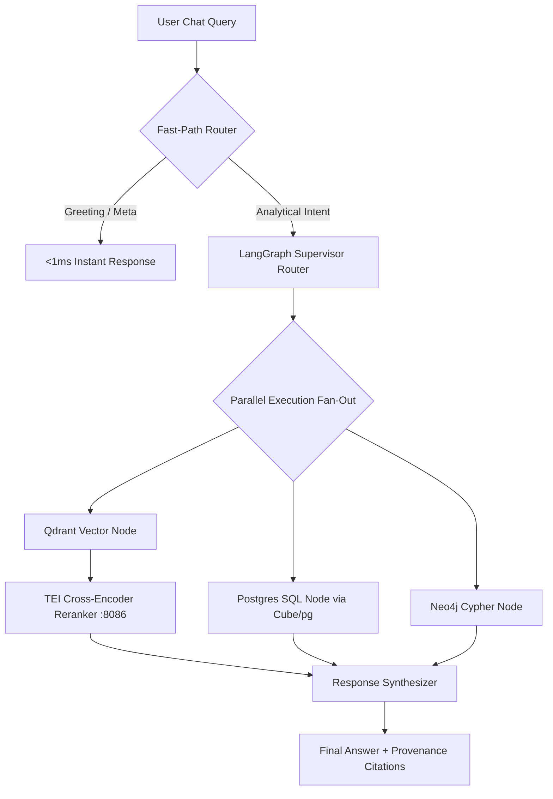

<p align="center">
  
</p>

<h1 align="center">Agentic Brain</h1>

<p align="center">
  <strong>LangGraph tri-modal RAG orchestrator — parallel SQL, Cypher graph traversal, and Qdrant hybrid vector search with specialized AI Employee personas.</strong>
</p>

<p align="center">
  <a href="../../README.md">🏠 Root README</a> ·
  <a href="../../architecture.md">📐 Architecture</a> ·
  <a href="../../decisions.md">🗂 Decisions</a>
</p>

---

## ⚡ Overview

`agentic-brain` is the AI orchestration service in Prism Core. It exposes a FastAPI server (`:8001`) that coordinates user questions via a LangGraph state machine across three distinct query modalities:

- 🗄 **SQL Modality**: Analytical queries over Postgres structured financial views (`view_standardized_balance_sheet`, `view_standardized_income_statement`, `view_receipt_line_items`).
- 🕸 **Cypher Modality**: Corporate structure & relationship queries over Neo4j knowledge graph.
- 🔍 **Vector Modality**: Semantic disclosure search over Qdrant with TEI embedding (`:8085`) & reranking (`:8086`).

It also hosts autonomous **AI Employee Personas** (*Forensic Accounting Auditor*, *Regulatory Compliance Officer*, *Credit Risk Analyst*, *Financial Research Analyst*) and an explicit `/task` worker pool.

---

## 🏗 Tri-Modal Orchestration Flow



---

## 🛠 Prerequisites & Setup

- **Python**: `3.10 – 3.12`
- **Package Manager**: Poetry
- **Services**: Postgres, Redis, Kafka, Neo4j, Qdrant, TEI sidecars (`:8085`, `:8086`)

```bash
# Install dependencies
poetry install

# Run API server
PYTHONPATH=src poetry run uvicorn api.main:app --host 0.0.0.0 --port 8001 --reload

# Run test suite
poetry run pytest

# Run with coverage
poetry run pytest --cov=src --cov-report=term-missing
```

---

## 📁 Repository Structure

```text
src/
  api/           # FastAPI app, routes (chat, system, HITL, tasks), middleware
  graph/         # LangGraph state machine, supervisor router, synthesizer
    nodes/       # Modality nodes (sql_agent, cypher_agent, vector_agent)
  tools/         # Tool drivers (postgres_tools, neo4j_tools, qdrant_tools, cube_tools)
  consumers/     # Background task worker pool & graph extraction consumers
  llm/           # LLMFactory & provider client wrappers
  core/          # Database connection pool, employee personas, configuration
  utils/         # HITL corrections & auditing utilities
scripts/         # Distillation script (export_corrections -> fine-tuning goldens)
tests/           # Unit, streaming, and tri-modal E2E test suite
```

---

## 👥 AI Employee Personas

| Persona ID | Title | Key Capabilities |
|---|---|---|
| `forensic_auditor` | Senior Forensic Accounting Auditor | P&L vs Cash Flow reconciliation, revenue anomaly detection, related-party disclosure audit |
| `compliance_officer` | SEC & Ind AS Compliance Lead | Footnote schedule completeness, lease commitments, debt maturity disclosures |
| `credit_analyst` | Principal Credit & Debt Analyst | Interest Coverage Ratio (EBIT / Interest), debt sustainability, liquid cash analysis |
| `research_assistant` | Financial Research Analyst | Top-line revenue summaries, margin trend breakdowns, PAT growth overviews |
