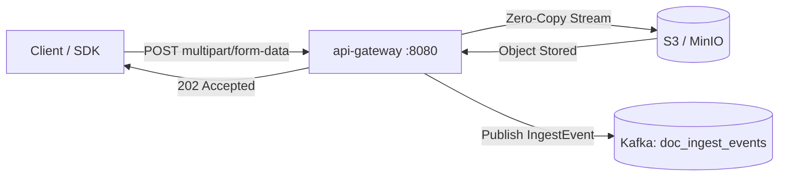

<p align="center">
  
</p>

<h1 align="center">API Gateway</h1>

<p align="center">
  <strong>Stateless Go ingress server — zero-copy upload streaming to S3, Kafka event publishing, and tenant routing.</strong>
</p>

<p align="center">
  <a href="../../README.md">🏠 Root README</a> ·
  <a href="../../architecture.md">📐 Architecture</a> ·
  <a href="../../decisions.md">🗂 Decisions</a>
</p>

---

## ⚡ Overview

`api-gateway` is the high-throughput Go entry point for all document uploads in Prism Core. It reads multipart file streams using `mime/multipart.Reader` and pipes them directly to object storage (S3 / MinIO) without buffering the payload in RAM. Once the object lands, it emits a Protobuf `IngestEvent` to Kafka and responds with `202 Accepted`.

---

## 🏗 High-Level Flow



---

## 🛠 Prerequisites & Setup

- **Go**: `1.25+`
- **Dependencies**: S3 (or S3Mock/MinIO) + Kafka (`doc_ingest_events`)

```bash
# Install dependencies
go mod download

# Run locally
go run ./cmd/api

# Run unit tests
go test -cover ./...
```

Listens on **8080** by default (`APP_PORT`).

---

## 📡 API Reference

### `POST /api/v1/upload`

Upload a document for async pipeline ingestion.

```bash
curl -X POST http://localhost:8080/api/v1/upload \
  -H "Authorization: Bearer <jwt>" \
  -H "X-Tenant-ID: default-tenant" \
  -F "file=@/path/to/annual_report.pdf"
```

**Response (`202 Accepted`)**:
```json
{
  "document_id": "doc_9f81a7c2b3e4",
  "status": "ACCEPTED",
  "s3_uri": "s3://prism-raw-documents/default-tenant/doc_9f81a7c2b3e4.pdf"
}
```

---

## 📁 Repository Structure

```text
cmd/api/                 # Process entrypoint & graceful shutdown
internal/
  app/                   # Ingress facade (hash verification, S3 pipe, Kafka dispatch)
  config/                # Viper & environment variable configuration
  http/                  # HTTP upload handlers & middleware
  infrastructure/        # S3 client, Kafka producer, OpenTelemetry tracing
```

---

## ⚙️ Environment Variables

| Variable | Default | Description |
|---|---|---|
| `APP_PORT` | `8080` | HTTP listen port |
| `KAFKA_BROKER` | `localhost:9092` | Kafka bootstrap brokers |
| `KAFKA_INGESTTOPIC` | `doc_ingest_events` | Kafka topic for raw ingest events |
| `S3_REGION` | `me-east-1` | AWS S3 region |
| `S3_BUCKET` | `prism-raw-documents` | Raw document bucket name |
| `S3_ENDPOINT` | _(empty)_ | S3 endpoint override (for S3Mock or MinIO) |
