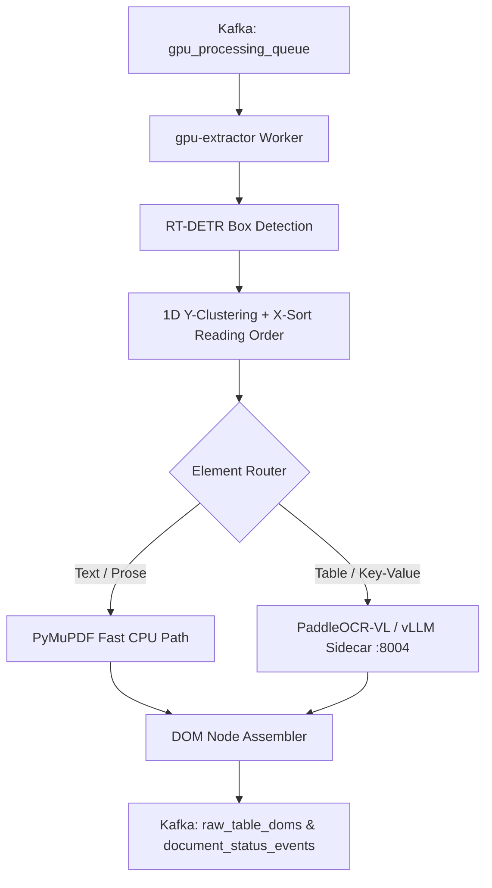

<p align="center">
  
</p>

<h1 align="center">GPU Extractor</h1>

<p align="center">
  <strong>Layout detection & VLM OCR worker — RT-DETR visual box detection, Y-clustering reading order, and DocumentDOM protobuf construction.</strong>
</p>

<p align="center">
  <a href="../../README.md">🏠 Root README</a> ·
  <a href="../../architecture.md">📐 Architecture</a> ·
  <a href="../../decisions.md">🗂 Decisions</a>
</p>

---

## ⚡ Overview

`gpu-extractor` is the visual extraction microservice in Prism Core. It consumes document tasks from Kafka (`gpu_processing_queue`), applies RT-DETR / Docling layout box detection, clusters elements by 1D Y-axis coordinates ($\varepsilon \approx 15\text{px}$) for natural reading order, routes text elements to PyMuPDF (cheap path) and complex tables to PaddleOCR-VL / vLLM (heavy VLM path), and emits `DocumentDOM` protobufs to Kafka.

---

## 🏗 Extraction Pipeline



---

## 🛠 Prerequisites & Setup

- **Python**: `3.10 – 3.12`
- **Package Manager**: Poetry
- **Services**: Kafka, S3, vLLM inference sidecar (`:8004`)

```bash
# Install dependencies
poetry install

# Run service locally
PYTHONPATH=src poetry run uvicorn main:app --host 0.0.0.0 --port 8000

# Run unit & integration tests
poetry run pytest
```

Health check endpoints:
- `GET /healthz` (Liveness)
- `GET /readyz` (Readiness)

---

## 📁 Repository Structure

```text
src/
  main.py            # FastAPI application lifespan (Kafka consumer & batcher init)
  api/               # Health & status endpoints
  broker/            # Kafka topic consumers & S3 object fetchers
  config/            # Settings & pydantic configuration
  core/
    engine.py        # DynamicBatcher for VLM batch processing
    service.py       # Layout detection & extraction orchestration
    dom/             # Preprocessing, DOM node building, and table JSON generation
    ml/              # RT-DETR layout slicer & VLM extractor adapters
  proto -> packages/contracts/gen/python/proto
tests/               # Unit & pipeline test suite
```

---

## ⚙️ Key Configuration Options

| Variable | Default | Description |
|---|---|---|
| `KAFKA_BROKER` | `localhost:9092` | Kafka bootstrap brokers |
| `KAFKA_GPUTOPIC` | `gpu_processing_queue` | Inbound extraction task topic |
| `VLLM_SERVER_URL` | `http://localhost:8004/v1` | vLLM / PaddleOCR-VL inference sidecar URL |
| `S3_ENDPOINT` | _(empty)_ | S3 endpoint override for MinIO / S3Mock |
| `BATCH_MAX_SIZE` | `8` | Maximum VLM extraction batch size |
| `READING_ORDER_EPSILON` | `15.0` | Y-axis coordinate clustering threshold in pixels |
