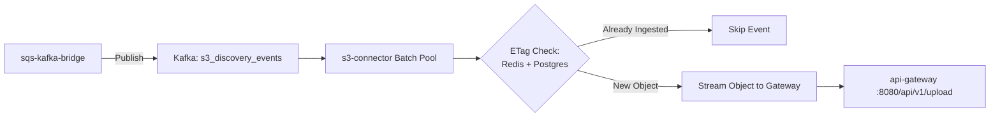

<p align="center">
  
</p>

<h1 align="center">S3 Connector</h1>

<p align="center">
  <strong>External object discovery worker — batch deduplication (Redis + Postgres) and upload stream dispatcher.</strong>
</p>

<p align="center">
  <a href="../../README.md">🏠 Root README</a> ·
  <a href="../../architecture.md">📐 Architecture</a> ·
  <a href="../../decisions.md">🗂 Decisions</a>
</p>

---

## ⚡ Overview

`s3-connector` processes external S3 bucket discovery notifications published to Kafka by `sqs-kafka-bridge`. It deduplicates discovered objects against Redis (cache) and Postgres (durable store), then streams new objects through `api-gateway` for full ingestion processing.

---

## 🏗 Processing Pipeline



---

## 🛠 Prerequisites & Setup

- **Go**: `1.25+`
- **Services**: Kafka, Redis, Postgres, and reachable `api-gateway`

```bash
# Install dependencies
go mod download

# Run ingestor worker
go run ./cmd/ingestor

# Run unit tests
go test -cover ./...
```

---

## 📁 Repository Structure

```text
cmd/ingestor/            # Process entrypoint & lifecycle management
internal/
  app/                   # Batch ingest orchestration & rate limiting
  config/                # Viper & environment variable configuration
  domain/                # S3 discovery event types & DTO definitions
  infrastructure/        # Kafka consumer, S3 reader, Redis/Postgres stores, Gateway HTTP client
```

---

## ⚙️ Environment Variables

| Variable | Default | Description |
|---|---|---|
| `KAFKA_BROKER` | `localhost:9092` | Kafka bootstrap brokers |
| `KAFKA_TOPIC` | `s3_discovery_events` | Kafka topic for discovered S3 objects |
| `KAFKA_GROUPID` | `ingestor_group` | Consumer group name |
| `REDIS_ADDR` | `localhost:6379` | Redis address for distributed locks & ETag cache |
| `POSTGRES_DSN` | `postgres://…` | Postgres connection string for durable ETag persistence |
| `GATEWAY_URL` | `http://localhost:8080/api/v1/upload` | Ingress upload API endpoint |
| `S3_ENDPOINT` | _(empty)_ | S3 endpoint override (for S3Mock or MinIO) |
| `APP_MAXBATCHSIZE` | `500` | Maximum Kafka messages consumed per batch iteration |
