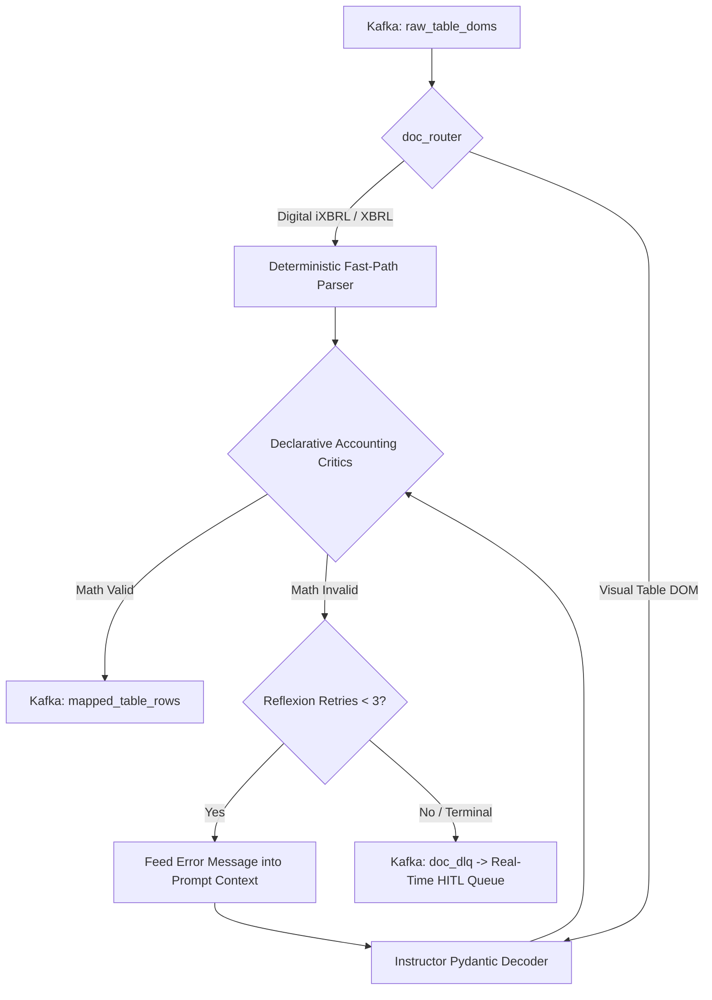

<p align="center">
  
</p>

<h1 align="center">Schema Aligner</h1>

<p align="center">
  <strong>Schema alignment & accounting critics worker — Instructor Pydantic decoding, iXBRL fast-paths, Reflexion repair loops, and HITL escalation.</strong>
</p>

<p align="center">
  <a href="../../README.md">🏠 Root README</a> ·
  <a href="../../architecture.md">📐 Architecture</a> ·
  <a href="../../decisions.md">🗂 Decisions</a>
</p>

---

## ⚡ Overview

`schema-aligner` processes extracted document tables (`raw_table_doms`). It features a dual-path pipeline:

1. **iXBRL / MCA Fast-Path**: Digital filings (SEC iXBRL HTML, Indian MCA XBRL XML) bypass VLM processing and parse embedded taxonomy tags directly with near 100% precision.
2. **Visual Table Alignment & Critics**: Unstructured table DOMs are aligned to target schemas in `registry.json` via Instructor guided decoding. Aligned rows pass through declarative **Accounting Critics** ($\text{Assets} = \text{L} + \text{E}$, $\text{PAT} = \text{PBT} - \text{Tax}$). Failed critics trigger an in-process **Reflexion** repair loop before escalating to HITL.

---

## 🏗 Alignment Pipeline



---

## 🛠 Prerequisites & Setup

- **Python**: `3.10 – 3.12`
- **Package Manager**: Poetry
- **Services**: Kafka + LLM provider API key (OpenAI / Anthropic / vLLM)

```bash
# Install dependencies
poetry install

# Run worker API
PYTHONPATH=src poetry run uvicorn main:app --host 0.0.0.0 --port 8001

# Run test suite
poetry run pytest

# Run evaluation suite against golden datasets
PYTHONPATH=src poetry run python evals/run_eval.py
```

---

## 📁 Repository Structure

```text
src/
  main.py              # FastAPI lifespan & Kafka consumer initialization
  api/                 # Operations & health check routes
  config/              # Settings & Pydantic config
  kafka/               # Kafka consumers (raw tables, schema CDC, dictionary CDC)
  core/
    alignment.py       # WaterfallAlignmentStrategy & chunking engine
    verification.py    # Accounting critic validation runner
    rule_engine.py     # Declarative critic execution engine
    reflexion.py       # In-process Reflexion repair loop
    doc_router.py      # Deterministic iXBRL vs visual router
    registry.json      # Canonical target schema registry
    packs/             # Jurisdiction-specific critic packs (US-GAAP, Ind AS)
evals/                 # Golden datasets & evaluation benchmark runner
tests/                 # Unit & critic test suite
```

---

## ⚙️ Accounting Critic Verification Rules

| Jurisdiction | Target Table | Primary Equation Gate |
|---|---|---|
| US-GAAP | `standardized_balance_sheet` | $\text{Total Assets} = \text{Total Liabilities} + \text{Stockholders Equity}$ |
| US-GAAP / Ind AS | `standardized_income_statement` | $\text{Net Income (PAT)} = \text{PBT} - \text{Tax Expense}$ |
| US-GAAP | `standardized_cash_flow` | $\text{Ending Cash} = \text{Beginning Cash} + \text{Net Cash Change}$ |
| General | `vendor_invoice_headers` | $\text{Total Amount} = \text{Subtotal} + \text{Tax Amount}$ |
