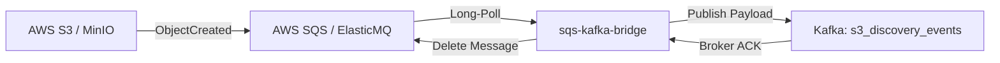

<p align="center">
  
</p>

<h1 align="center">SQS → Kafka Bridge</h1>

<p align="center">
  <strong>Reliable AWS SQS worker — bridges S3 bucket notification payloads to Kafka with transactional ACK semantics.</strong>
</p>

<p align="center">
  <a href="../../README.md">🏠 Root README</a> ·
  <a href="../../architecture.md">📐 Architecture</a> ·
  <a href="../../decisions.md">🗂 Decisions</a>
</p>

---

## ⚡ Overview

`sqs-kafka-bridge` long-polls AWS SQS (or ElasticMQ in local development) for bucket notification events (`ObjectCreated`). It publishes the event payload to Kafka (`s3_discovery_events`) and deletes the message from SQS **only after** a successful Kafka broker acknowledgment.

---

## 🏗 Processing Pipeline



---

## 🛠 Prerequisites & Setup

- **Go**: `1.25+`
- **Services**: AWS SQS (or ElasticMQ) + Kafka

```bash
# Install dependencies
go mod download

# Run bridge worker
go run ./cmd/bridge

# Run unit tests
go test -cover ./...
```

---

## 📁 Repository Structure

```text
cmd/bridge/                 # Entrypoint & signal handling
internal/
  app/                      # Long-poll -> publish -> delete orchestration loop
  config/                   # Environment & Viper configuration
  infrastructure/aws/       # AWS SQS client & ElasticMQ endpoint override
  infrastructure/kafka/     # Kafka sync producer implementation
```

---

## ⚙️ Environment Variables

| Variable | Default | Description |
|---|---|---|
| `SQS_QUEUE_URL` | _(required)_ | Full SQS queue URL |
| `KAFKA_BROKER` | _(required)_ | Kafka bootstrap brokers |
| `KAFKA_TOPIC` | `s3_discovery_events` | Target Kafka discovery topic |
| `AWS_REGION` | `me-east-1` | AWS region |
| `SQS_ENDPOINT` | _(empty)_ | SQS endpoint override for local ElasticMQ |
| `APP_MAXMESSAGES` | `10` | Maximum messages per SQS ReceiveMessage call |
| `AWS_WAITTIMESECONDS` | `20` | SQS long-poll wait duration in seconds |
