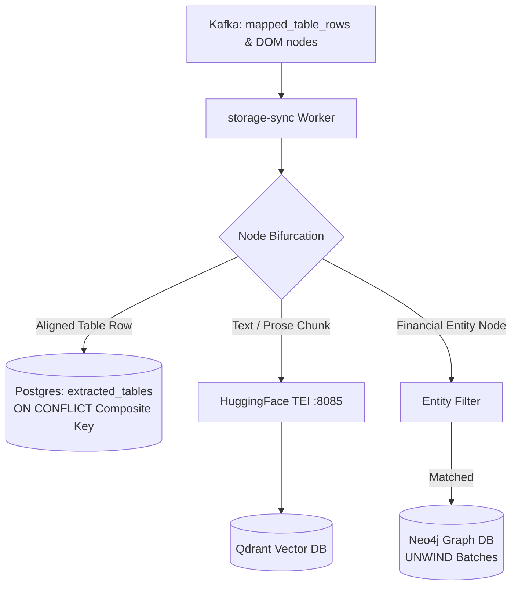

<p align="center">
  
</p>

<h1 align="center">Storage Sync</h1>

<p align="center">
  <strong>Data synchronization & vector/graph ingestion worker — DOM bifurcation, Postgres JSONB upserts, Qdrant vector embedding, and Neo4j UNWIND batching.</strong>
</p>

<p align="center">
  <a href="../../README.md">🏠 Root README</a> ·
  <a href="../../architecture.md">📐 Architecture</a> ·
  <a href="../../decisions.md">🗂 Decisions</a>
</p>

---

## ⚡ Overview

`storage-sync` is the multi-store persistence and bifurcation engine of Prism Core. It consumes aligned rows (`mapped_table_rows`) and raw DOM nodes (`document_dom_nodes`), performing:

1. **Relational Upserts**: Idempotent Postgres upserts on composite key `(document_id, node_id, row_index)` into `extracted_tables`.
2. **Dense Vector Ingestion**: Precomputes batch embeddings via TEI (`:8085`) and writes prose chunks directly to Qdrant.
3. **Graph Triple Batching**: Pre-filters financial entity nodes and executes single-transaction `UNWIND` Cypher batches into Neo4j.
4. **CDC Consistency**: Monitored Postgres changes update BI views and vector indices asynchronously.

---

## 🏗 Storage Pipeline



---

## 🛠 Prerequisites & Setup

- **Python**: `3.10 – 3.12`
- **Package Manager**: Poetry
- **Services**: Postgres, Kafka, Qdrant, Neo4j, TEI embeddings sidecar (`:8085`)

```bash
# Install dependencies
poetry install

# Run worker process
PYTHONPATH=src poetry run python -m main

# Execute database migrations
poetry run alembic upgrade head

# Run unit tests
poetry run pytest
```

---

## 📁 Repository Structure

```text
src/
  main.py                 # Worker process entrypoint & consumer coordinator
  config/                 # Settings & environment configuration
  db/                     # SQLAlchemy async engine, models, and BI view codegen
  repositories/           # Postgres upsert repositories & Qdrant vector client
  kafka/
    consumers/            # Bifurcation, status updates, DLQ, and HITL consumers
    cdc/                  # Postgres extracted_tables event observer -> Qdrant CDC sync
  proto -> packages/contracts/gen/python/proto
alembic/                  # Database migration scripts
tests/                    # Test suite
```

---

## ⚙️ Environment Variables

| Variable | Default | Description |
|---|---|---|
| `KAFKA_BROKER` | `localhost:9092` | Kafka bootstrap brokers |
| `DATABASE_URL` | `postgresql+asyncpg://…` | Async Postgres connection DSN |
| `QDRANT_URL` | `http://localhost:6333` | Qdrant HTTP service endpoint |
| `QDRANT_COLLECTION_NAME` | `document_chunks` | Qdrant collection name |
| `CDC_MAX_CONCURRENT_INFERENCES` | `5` | Maximum concurrent CDC batch inferences |
| `CHUNK_ASSEMBLE_TIMEOUT_SECONDS` | `900` | DOM chunk assembly timeout in seconds |
| `SCHEMA_REGISTRY_PATH` | _(auto)_ | Path to `registry.json` for BI view codegen |
