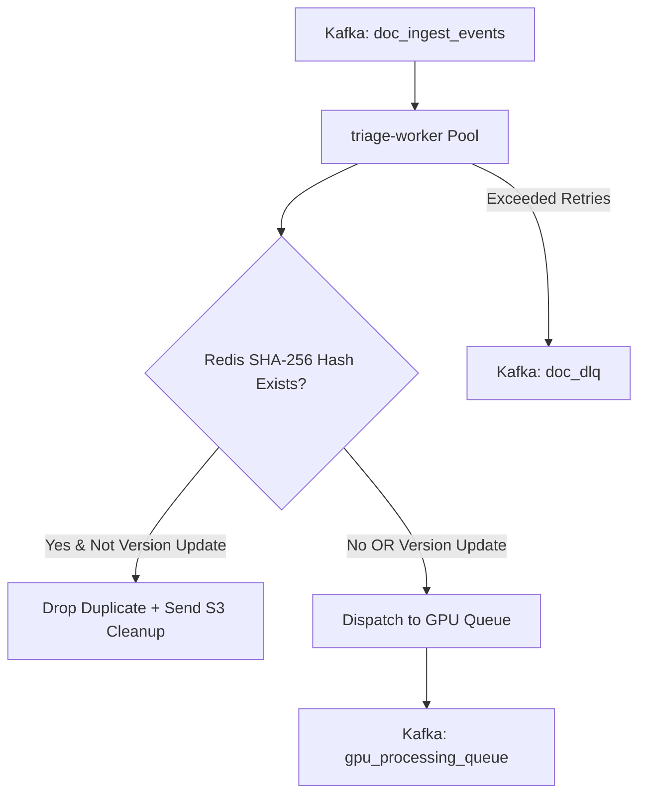

<p align="center">
  
</p>

<h1 align="center">Triage Worker</h1>

<p align="center">
  <strong>High-concurrency Go worker — exact-hash deduplication, version routing, and retry DLQ management.</strong>
</p>

<p align="center">
  <a href="../../README.md">🏠 Root README</a> ·
  <a href="../../architecture.md">📐 Architecture</a> ·
  <a href="../../decisions.md">🗂 Decisions</a>
</p>

---

## ⚡ Overview

`triage-worker` is a high-throughput Go service that sits directly behind the `doc_ingest_events` Kafka topic. It inspects incoming document events using a Redis-backed chain-of-responsibility pattern:

1. **Exact-Hash Deduplication**: Computes exact SHA-256 hash checks via Redis to drop duplicate uploads instantly.
2. **Version Update Path**: If `is_version_update` is flagged, updates document version pointer while passing work downstream.
3. **Queue Dispatch & Poison Pill Escalation**: Routes valid work to `gpu_processing_queue` or escalates to `doc_dlq` after `APP_MAXRETRIES` attempts.

---

## 🏗 Processing Pipeline



---

## 🛠 Prerequisites & Setup

- **Go**: `1.25+`
- **Services**: Kafka + Redis

```bash
# Install dependencies
go mod download

# Run worker
go run ./cmd/worker

# Run unit tests
go test -cover ./...
```

---

## 📁 Repository Structure

```text
cmd/worker/                 # Entrypoint & signal handling
internal/
  app/                      # Worker pool & message lifecycle coordinator
    pipeline/               # Exact-hash dedup & version update evaluation
    routing/                # Kafka topic publication strategy
  config/                   # Environment & Viper configuration
  infrastructure/
    kafka/                  # Consumer group & producer implementations
    redis/                  # Hash cache & failure counter client
```

---

## ⚙️ Environment Variables

| Variable | Default | Description |
|---|---|---|
| `KAFKA_BROKER` | `localhost:9092` | Kafka bootstrap brokers |
| `KAFKA_CONSUMERGROUP` | `triage-worker-group` | Kafka consumer group name |
| `KAFKA_INGESTTOPIC` | `doc_ingest_events` | Source topic for incoming ingest events |
| `KAFKA_GPUTOPIC` | `gpu_processing_queue` | Target topic for validated extraction work |
| `KAFKA_DLQTOPIC` | `doc_dlq` | Dead-letter topic for poison pill events |
| `REDIS_ADDR` | `localhost:6379` | Redis host & port for deduplication cache |
| `APP_CONCURRENCY` | `100` | In-flight goroutine processing concurrency cap |
| `APP_MAXRETRIES` | `3` | Maximum failure attempts before DLQ escalation |
