# Prism Core — System Architecture

How Prism Core turns messy business documents into structured data you can query — and what happens when the model is wrong.

If you only read one architecture document in this repo, make it this one. Cross-cutting ADRs live in [`decisions.md`](decisions.md); the overarching project pitch and quickstart are in [`README.md`](README.md); research papers studied are in [`research.md`](research.md).

---

## What I’m Solving

Most “document AI” demos do this:

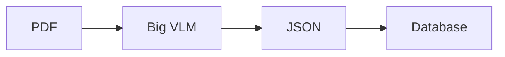

That falls apart on real financial PDFs: columns get read in the wrong order, tables shift indexes, numbers look fine as JSON but break basic accounting, and if you write Postgres + Neo4j + Qdrant in one shot you get split-brain when one store dies.

I scoped the problem more narrowly:

> Extract trustworthy rows from messy business docs, refuse to promote junk, and let an analyst ask questions against what actually landed.

Not “chat with any PDF on earth.” Finance-ish documents first (SEC 10-K, Indian Annual Reports / Ind AS, invoices, receipts). Depth over coverage.

---

## The Bet

Accuracy isn’t one clever prompt. It’s a multi-stage verification pipeline. Each stage kills a specific failure mode, then I query the structured result — not the raw pixels.

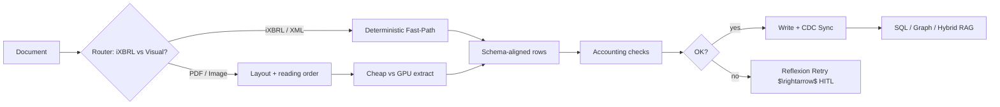

---

## High-Level Topology

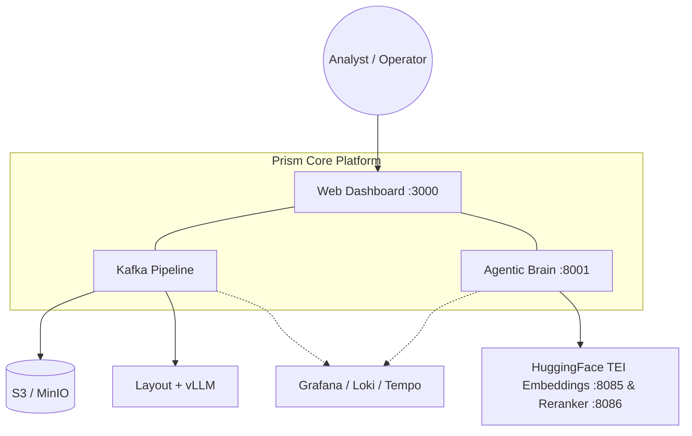

Work moves through Kafka. The UI watches the queue, handles real-time HITL reviews via SSE, and provides multi-modal chat & autonomous agent workflows.

---

## How the Boxes Fit Together

I split the work on purpose to leverage the distinct strengths of two very different ecosystems: Go and Python.

**Go (Ingress & Triage)**
Go handles the high-throughput, IO-bound edge of the system. Its concurrency model (goroutines) and low memory footprint make it perfect for streaming massive multi-gigabyte uploads without buffering to RAM (in `api-gateway`) and managing thousands of concurrent connections (in `triage-worker`). It easily absorbs IO storms that would choke a standard Python web server.

**Python (Vision, Alignment & Agents)**
Python owns the compute-heavy, AI-driven core: PyMuPDF for fast layout extraction, PyTorch/vLLM for running RT-DETR and large language models on GPUs, Instructor for structured JSON extraction, and LangGraph for complex agentic workflows. Python operates off Kafka or internal gRPC/HTTP endpoints away from direct multi-gigabyte web edges.

Chat is its own isolated service so a GPU OOM on the extraction side doesn’t take down Q&A.

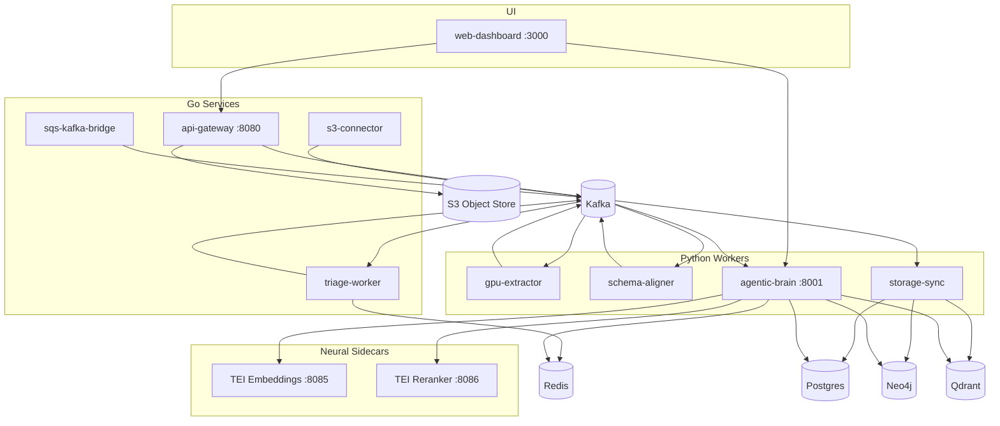

### Microservices at a Glance

| Service | Role | Tech Stack |
|---------|------|------------|
| `api-gateway` | Zero-copy upload stream to S3 + publish `IngestEvent` | Go 1.25 |
| `sqs-kafka-bridge` | Bridge AWS SQS / ElasticMQ bucket notifications to Kafka | Go 1.25 |
| `s3-connector` | Consume S3 discovery events $\rightarrow$ dedupe $\rightarrow$ queue gateway upload | Go 1.25 |
| `triage-worker` | Exact-hash dedupe via Redis + versioning route / DLQ | Go 1.25 |
| `gpu-extractor` | Layout box detection + Y-clustering reading order + VLM OCR $\rightarrow$ `DocumentDOM` | Python (PyMuPDF, vLLM, RT-DETR) |
| `schema-aligner` | iXBRL fast-path parser + Instructor alignment + accounting critics + Reflexion | Python (Pydantic, Instructor) |
| `storage-sync` | Bifurcation engine, Postgres JSONB upserts, Qdrant vectors, Neo4j `UNWIND` batching | Python (Alembic, Qdrant, Neo4j) |
| `agentic-brain` | LangGraph tri-modal chat (SQL + Cypher + Vector) + fast-path router + `/task` agents | Python (LangGraph, TEI, FastAPI) |
| `web-dashboard` | Operator UI (queue, real-time SSE HITL cards, multi-modal chat, agent list) | Next.js 14, React, Tailwind |

---

## Detailed Pipeline Architecture

### 1. Dual Ingestion Engine: iXBRL Fast-Path vs Visual Extraction

When a document enters `schema-aligner`, the `doc_router` determines if the file is a structured digital filing (e.g. SEC iXBRL HTML or Indian MCA/BSE XBRL XML) or a visual document (PDF/Image).

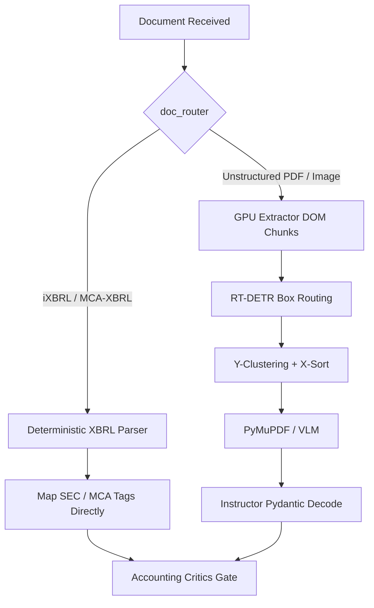

- **iXBRL Fast-Path (`ixbrl_parser.py`, `mca_xbrl_parser.py`)**: Bypasses heavy VLM rendering entirely, parsing embedded XBRL taxonomy tags with near 100% precision.
- **Visual VLM Path (`gpu-extractor`)**: Uses RT-DETR / Docling layout box detection, applies 1D Y-clustering ($\varepsilon \approx 15\text{px}$) to fix multi-column reading order, routes text regions to PyMuPDF and tables to heavy VLMs.

---

### 2. Accounting Critics & Bounded Reflexion Repair

Before any extracted row is promoted to Postgres, it must pass declarative accounting critics ($\text{Assets} = \text{L} + \text{E}$, $\text{PAT} = \text{PBT} - \text{Tax}$, Cash Flow rollups, Bank running balance).

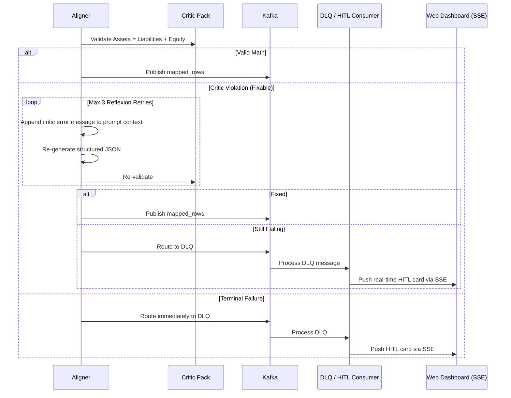

If critic checks fail, a bounded **Reflexion loop** injects the exact equation error back into the prompt context for auto-repair. If retries expire or fail terminally, the row is routed to **HITL** for human review in the Web Dashboard.

---

### 3. Storage Synchronization & Graph `UNWIND` Batching

Aligned rows land in Postgres with an idempotent key: `(document_id, node_id, row_index)` on conflict upsert. Prose nodes are converted into dense vector embeddings via the local TEI sidecar (`:8085`) and written to Qdrant.

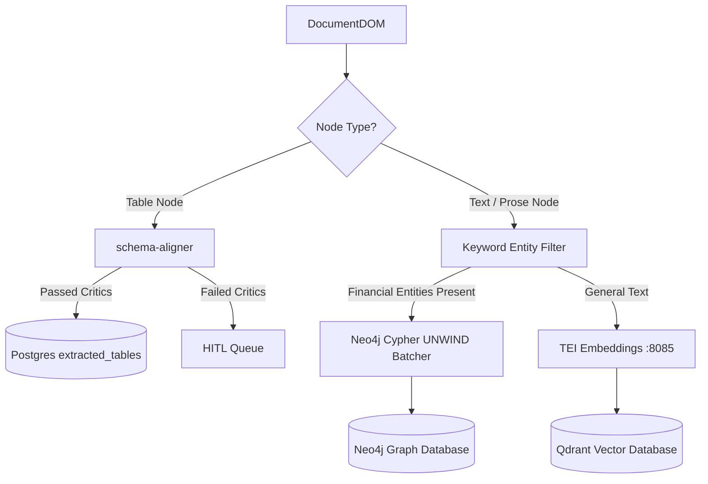

- **Graph Ingestion Optimization**: `storage-sync` pre-filters text nodes for financial domain entities before dispatching triples. Entities are ingested into Neo4j in single-transaction `UNWIND` Cypher batches, eliminating graph lock contention during high-concurrency ingestion.

---

### 4. Agentic Brain & Zero-Latency Chat Fast-Paths

The `agentic-brain` orchestrates Q&A via a LangGraph state machine. It uses local TEI neural microservices (`bge-small-en-v1.5` for embeddings and `bge-reranker-base` for cross-encoder reranking).

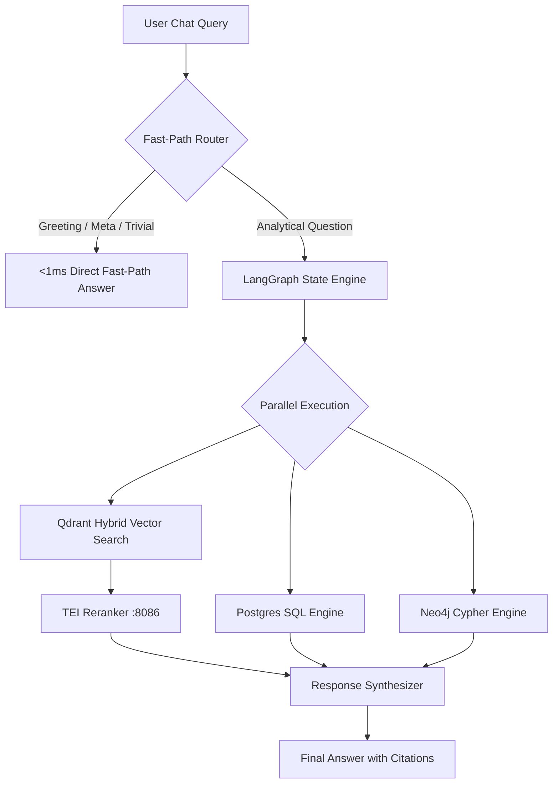

- **Zero-Latency Fast-Paths**: Non-analytical or conversational queries trigger a sub-$1\text{ms}$ sub-agent response, skipping costly database fan-out.
- **Tri-Modal Fan-Out**: Analytical queries run SQL, Cypher graph traversal, and hybrid vector search concurrently with tenant ID isolation enforced at the tool wrapper level.

---

## Data Plane & Schema

Shared Protobuf contracts (`IngestEvent`, `DocumentDOM`) decouple Go ingress from Python ML workers.

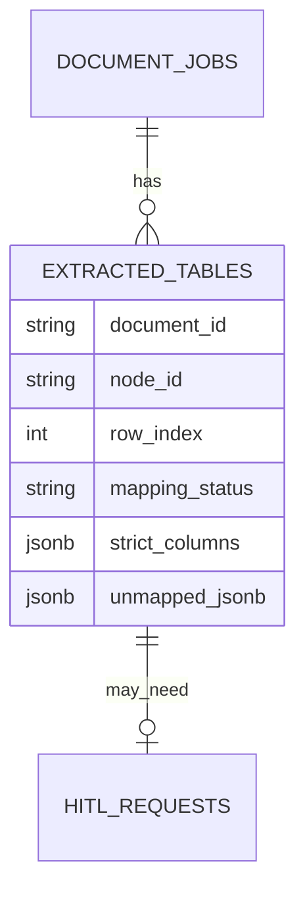

- `strict_columns` stores validated, clean row data.
- `unmapped_jsonb` holds schema drift, critic failure logs, and reflexion attempts displayed in the HITL card UI.

---

## Observability & Telemetry

OpenTelemetry context is propagated across Kafka message headers. Every log entry includes `trace_id` and `span_id` formatted for Loki and Tempo integration in Grafana.

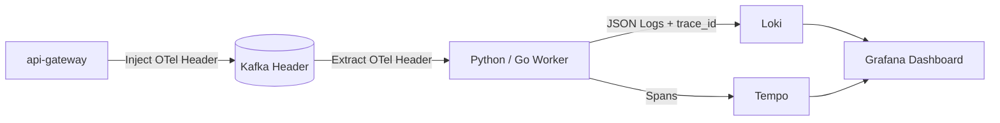

---

## Horizontal Scalability & Distributed Architecture

Prism Core is designed as a stateless, distributed system capable of scaling out horizontally under heavy firehose loads without architectural bottlenecks:

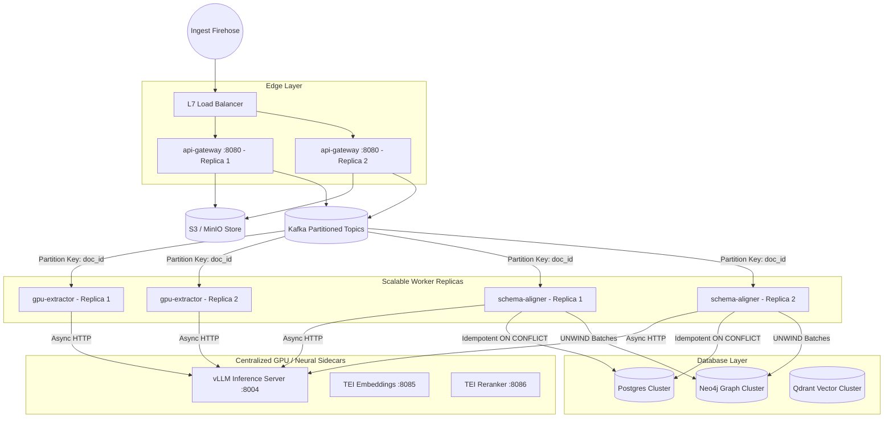

### Key Scaling Mechanics:
1. **Stateless Ingress Scaling**: `api-gateway` streams multipart uploads directly to S3 with zero memory buffering (`mime/multipart.Reader`). N replicas sit behind an L7 load balancer with zero shared state.
2. **Kafka Consumer Group Scaling**: All compute-heavy Go and Python services (`triage-worker`, `gpu-extractor`, `schema-aligner`, `storage-sync`) operate as consumer groups. Worker capacity scales linearly by increasing Kafka topic partitions (`docker-compose up --scale gpu-extractor=4 --scale schema-aligner=8`).
3. **Decoupled Centralized Model Sidecars**: Heavy model weights (vLLM, PaddleOCR-VL, TEI) run in centralized microservices (`:8004`, `:8085`, `:8086`). Workers scale on cheap CPU compute nodes while GPU instances scale independently behind `asyncio.Semaphore` rate limiters.
4. **Stateless Worker Task Claiming (`SKIP LOCKED`)**: Background task workers in `agentic-brain` claim jobs directly from Postgres via `SELECT ... FOR UPDATE SKIP LOCKED`. Multiple replicas claim tasks concurrently without lock contention or distributed Redis lock overhead.
5. **Idempotent Partition Re-Balancing**: All Postgres writes use composite natural keys `(document_id, node_id, row_index)` on conflict upserts, and Qdrant uses deterministic UUIDv5 generated from `(document_id, node_id)`. Re-balances or consumer retries never create duplicate rows or vector drift.

---

## Summary Diagram

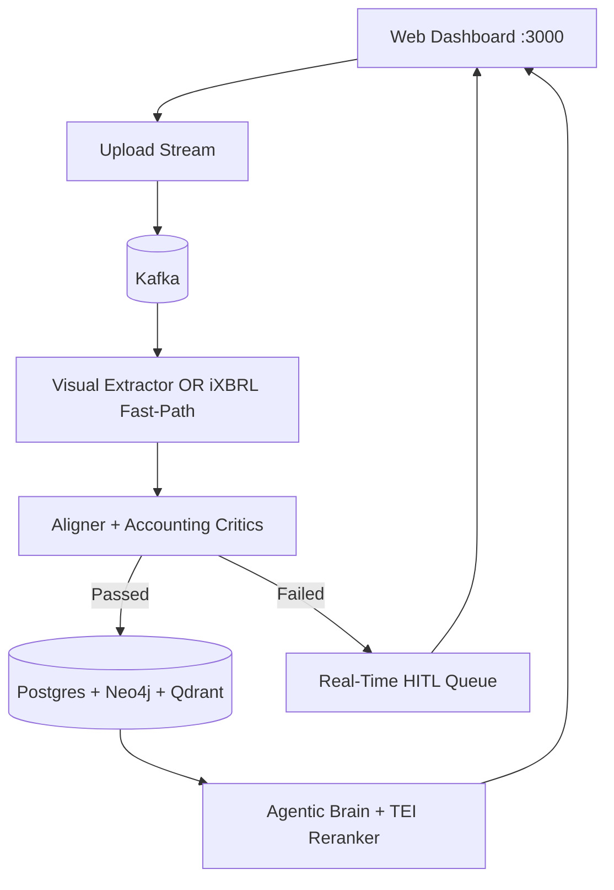
