

  

<h1 align="center">Prism Core — System Architecture</h1>

  How Prism Core turns messy business documents into structured data you can query — and what happens when the model is wrong.

  <a href="README.md">🏠 README</a> ·
  <a href="decisions.md">🗂 ADRs</a> ·
  <a href="research.md">📚 Research</a> ·
  <a href="infra/README.md">🔧 Infra</a>

---

## 🎯 The Problem

Most "document AI" demos do this:

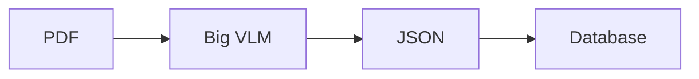

That falls apart on real financial PDFs: columns get read in the wrong order, tables shift indexes, numbers look fine as JSON but break basic accounting, and if you write Postgres + Neo4j + Qdrant in one shot you get split-brain when one store dies.

> **Prism Core's scope:** Extract trustworthy rows from messy business docs, refuse to promote junk, and let an analyst ask questions against what actually landed. Depth over coverage.

---

## 💡 The Bet

Accuracy isn't one clever prompt. It's a multi-stage verification pipeline. Each stage kills a specific failure mode, then queries the structured result — not the raw pixels.

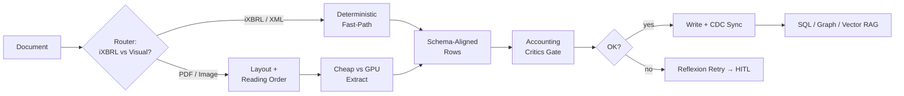

---

## 🗺 High-Level Topology

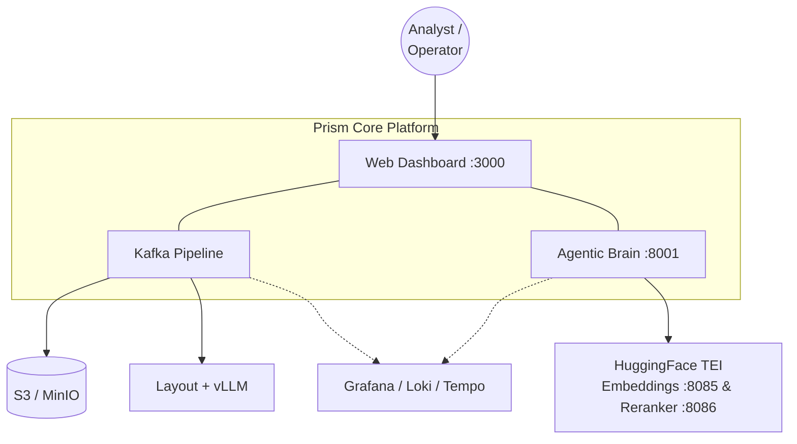

Work moves through Kafka. The UI watches the queue, handles real-time HITL reviews via SSE, and provides multi-modal chat & autonomous agent workflows.

---

## 🔲 Microservices Map

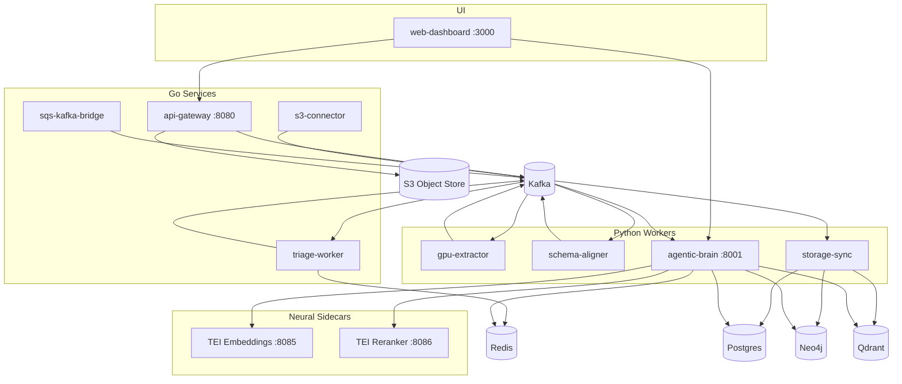

### Service Roles

| Service | Language | Role |
|---|---|---|
| `api-gateway` | Go | Zero-copy upload stream to S3 + publish `IngestEvent` |
| `sqs-kafka-bridge` | Go | Bridge AWS SQS / ElasticMQ bucket notifications to Kafka |
| `s3-connector` | Go | S3 discovery events → dedupe → queue gateway upload |
| `triage-worker` | Go | Exact-hash dedupe via Redis + versioning route / DLQ |
| `gpu-extractor` | Python | Layout box detection + Y-clustering + VLM OCR → `DocumentDOM` |
| `schema-aligner` | Python | iXBRL fast-path + Instructor alignment + accounting critics + Reflexion |
| `storage-sync` | Python | Bifurcation engine, Postgres JSONB upserts, Qdrant vectors, Neo4j `UNWIND` |
| `agentic-brain` | Python | LangGraph tri-modal RAG (SQL + Cypher + Vector) + `/task` agent runner |
| `web-dashboard` | TypeScript | Operator UI — queue, real-time HITL cards, chat, agent list |

---

## 🔬 Detailed Pipeline Stages

<strong>Stage 1 — Dual Ingestion: iXBRL Fast-Path vs Visual VLM</strong>

When a document enters `schema-aligner`, the `doc_router` determines if the file is a structured digital filing (SEC iXBRL HTML or Indian MCA/BSE XBRL XML) or a visual document (PDF/Image).

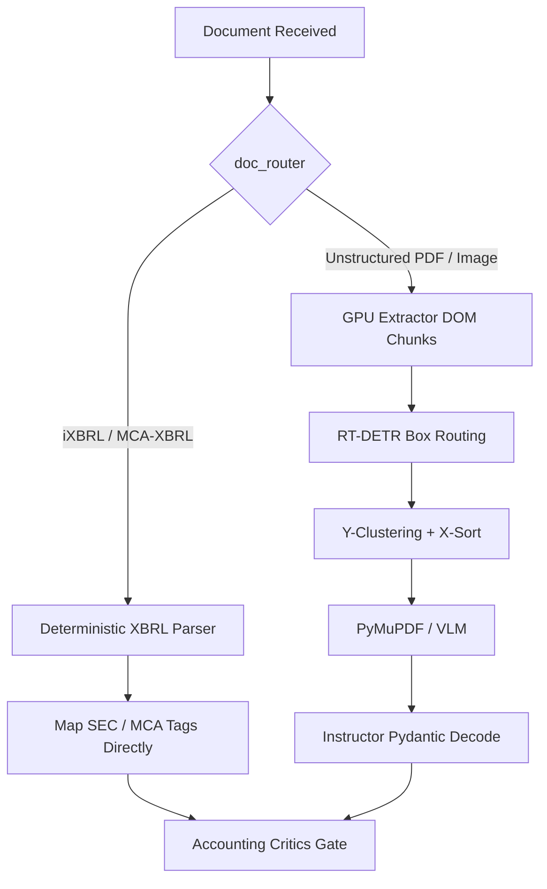

- **iXBRL Fast-Path** (`ixbrl_parser.py`, `mca_xbrl_parser.py`) — bypasses VLM rendering, parses XBRL taxonomy tags with near 100% precision.
- **Visual VLM Path** (`gpu-extractor`) — RT-DETR layout box detection, 1D Y-clustering (ε ≈ 15px) for multi-column reading order, PyMuPDF for text and VLMs for tables.

<strong>Stage 2 — Accounting Critics & Bounded Reflexion Repair</strong>

Before any extracted row is promoted to Postgres, it must pass declarative accounting critics.

| Rule | Equation |
|---|---|
| Balance Sheet | Assets = Liabilities + Equity |
| Income Statement | PAT = PBT − Tax |
| Cash Flow | Rollup reconciliation |
| Bank Statement | Running balance check |

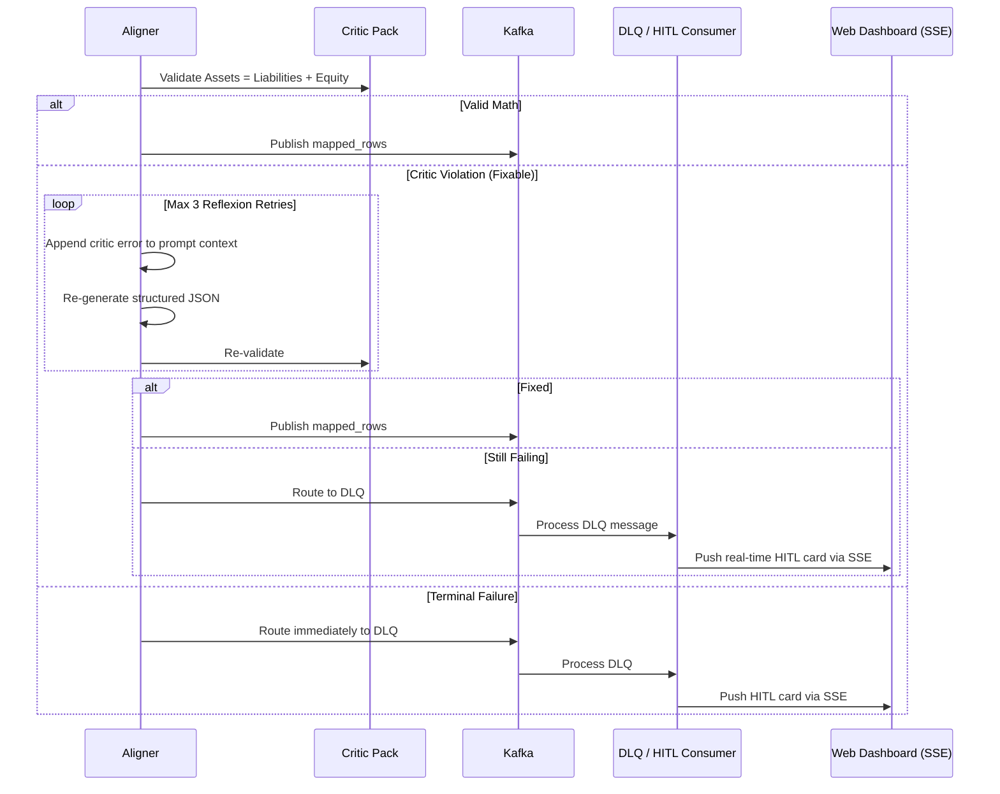

<strong>Stage 3 — Storage Sync & Graph UNWIND Batching</strong>

Aligned rows land in Postgres with idempotent key `(document_id, node_id, row_index)`. Prose nodes become dense vector embeddings via the local TEI sidecar (`:8085`) written to Qdrant.

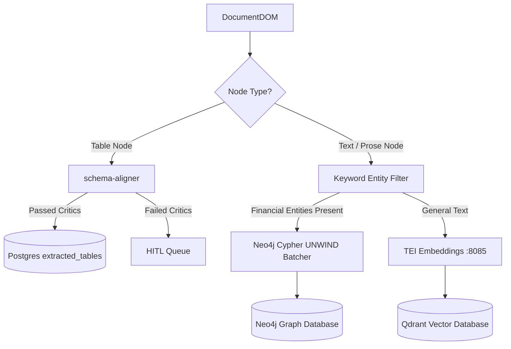

`storage-sync` pre-filters text nodes for financial domain entities before dispatching graph triples. Entities are ingested in single-transaction `UNWIND` Cypher batches, eliminating graph lock contention.

<strong>Stage 4 — Agentic Brain & Zero-Latency Fast-Paths</strong>

The `agentic-brain` orchestrates Q&A via a LangGraph state machine with parallel tri-modal fan-out.

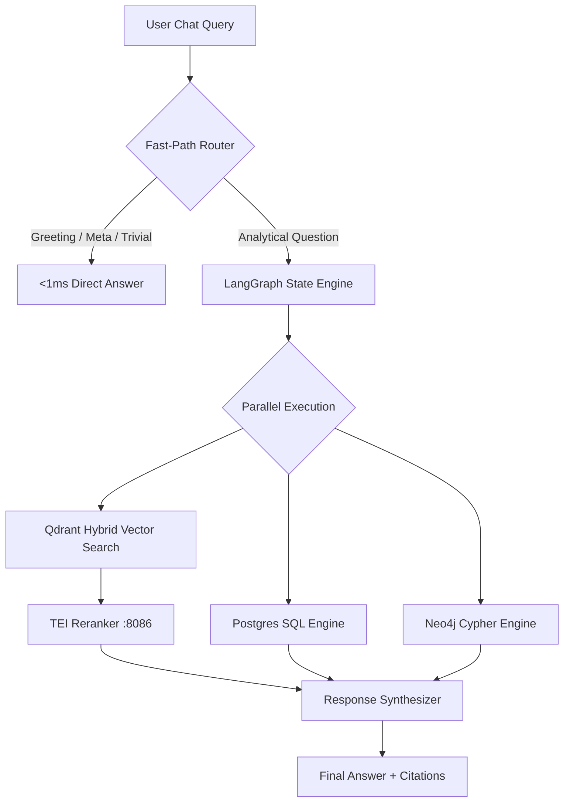

- **Zero-Latency Fast-Paths** — non-analytical queries skip costly database fan-out entirely, answering in <1ms.
- **Tri-Modal Fan-Out** — SQL, Cypher graph traversal, and hybrid vector search run concurrently with tenant ID isolation enforced at the tool wrapper level.

---

## 🗄 Data Schema

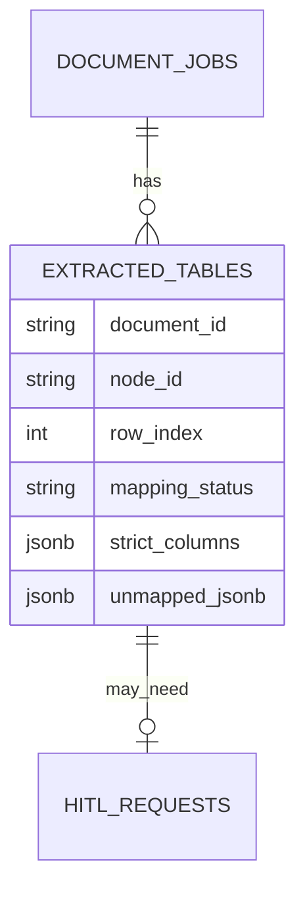

- `strict_columns` — validated, clean row data.
- `unmapped_jsonb` — schema drift, critic failure logs, and reflexion attempts surfaced in the HITL card UI.

---

## 📡 Observability

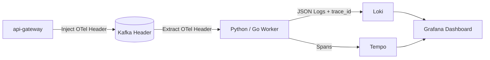

OTel context propagated through Kafka message headers end-to-end across Go and Python microservices.

---

## 📈 Horizontal Scalability

<strong>Scaling architecture diagram</strong>

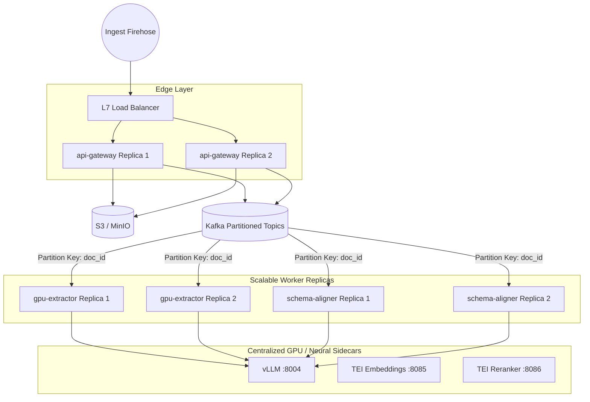

| Mechanic | How |
|---|---|
| Stateless Edge Streaming | `api-gateway` streams directly to S3, zero memory buffering |
| Kafka Consumer Group Scaling | `docker-compose up --scale gpu-extractor=4 --scale schema-aligner=8` |
| Decoupled Model Sidecars | Workers scale on CPU nodes; GPU inference scales independently |
| Stateless Task Claiming | `FOR UPDATE SKIP LOCKED` — no Redis locks needed |
| Idempotent Re-Balancing | Composite natural keys `(document_id, node_id, row_index)` + UUIDv5 |

---

## 🔚 End-to-End Summary

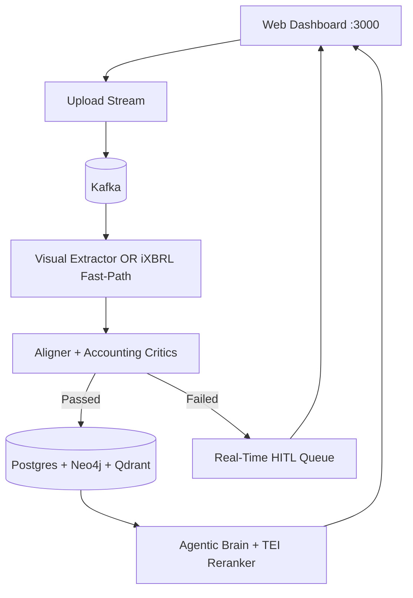
