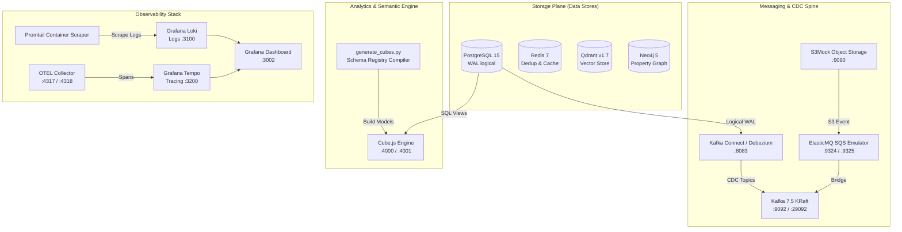

<p align="center">
  
</p>

<h1 align="center">Prism Core — Infrastructure Subsystem</h1>

<p align="center">
  Unified local infrastructure, database sidecars, CDC streaming, semantic analytics engine, and full-stack observability.
</p>

<p align="center">
  <a href="../README.md">🏠 Root README</a> ·
  <a href="../architecture.md">📐 Architecture</a> ·
  <a href="../decisions.md">🗂 Architecture Decisions</a> ·
  <a href="decision.md">🔧 Infra ADR</a> ·
  <a href="../packages/contracts/README.md">📜 Contracts</a>
</p>

---

## 📌 Overview

The `infra/` directory houses the shared data plane, event streaming infrastructure, analytics engine, and observability telemetry stack for **Prism Core**. While product microservices live in [`apps/`](../apps/) and run from the root `docker-compose.yml`, `infra/` provides the low-latency backplane required for high-throughput multimodal document parsing, vector indexing, graph RAG, and CDC (Change Data Capture).

Design rationale and architecture decision records for infrastructure live in [`decision.md`](./decision.md).

---

## 🏗 Subsystem Architecture



---

## 🗂 File & Directory Layout

```text
infra/
├── docker-compose.yml          # Complete infra compose spec (Data + Messaging + Obs + Cube)
├── decision.md                 # Infrastructure Architecture Decision Record (ADR)
├── README.md                   # Infrastructure guide (this file)
├── elasticmq.conf              # SQS-compatible queue configuration (dead-letter, retry delays)
├── cube/                       # Semantic analytics engine configuration & schema models
│   ├── cube.js                 # Cube.js environment & security context setup
│   ├── generate_cubes.py       # Compiles apps/schema-aligner/src/core/registry.json -> YAML cubes
│   └── model/cubes/            # Auto-generated Cube YAML models (view_contract_headers.yml, etc.)
├── kafka-connect/              # Debezium CDC connector payloads
│   └── register-debezium.json  # PostgreSQL logical replication connector manifest
├── logging/                    # Telemetry configuration & Grafana provisioning
│   ├── loki-config.yml         # Loki log retention and indexing config
│   ├── promtail-config.yml     # Docker container log scraping rules
│   ├── tempo-config.yml        # Distributed tracing storage & receiver config
│   ├── otel-collector-config.yml # OTLP gRPC/HTTP receiver pipelines
│   └── grafana/provisioning/  # Datasources & dashboards pre-wired for Loki + Tempo
└── scripts/                    # Hardware/GPU auxiliary runner scripts
    ├── start_smoldocling.sh    # vLLM MLX / SmolDocling inference server startup
    ├── lightning-vllm-start.sh # PyTorch / vLLM GPU sidecar daemon
    └── layout_heron_server.py  # Fast Layout analysis HTTP wrapper
```

---

## 🔌 Service Port Map & Matrix

| Service | Category | Host Ports | Protocol / Purpose | Health Check / Validation |
|---|---|---|---|---|
| **PostgreSQL 15** | Relational DB | `5432` | SQL (`wal_level=logical`) | `pg_isready -U postgres` |
| **Kafka (KRaft)** | Event Streaming | `9092`, `29092` | PLAINTEXT broker & host listener | KRaft Quorum `:29093` |
| **Kafka Connect** | CDC Engine | `8083` | HTTP REST API (Debezium) | `GET http://localhost:8083/` |
| **Qdrant** | Vector Search | `6333`, `6334` | HTTP REST (`6333`), gRPC (`6334`) | `GET http://localhost:6333/healthz` |
| **Neo4j 5** | Knowledge Graph | `7474`, `7687` | HTTP Browser (`7474`), Bolt (`7687`) | `GET http://localhost:7474/` |
| **Redis 7** | Cache / Dedup | `6379` | RESP protocol | `redis-cli ping` |
| **S3Mock** | Storage Emulator | `9090` | AWS S3 API | `curl http://localhost:9090/` |
| **ElasticMQ** | Queue Emulator | `9324`, `9325` | AWS SQS API (`9324`), Web UI (`9325`) | `GET http://localhost:9325/` |
| **Cube.js** | Semantic Layer | `4000`, `4001` | REST/GraphQL API (`4000`), Dev UI (`4001`) | `GET http://localhost:4000/readyz` |
| **Grafana Loki** | Log Collector | `3100` | HTTP push / query API | `GET http://localhost:3100/ready` |
| **Grafana Tempo** | Tracing Backend | `3200` | OTLP / Tempo query API | `GET http://localhost:3200/ready` |
| **OTEL Collector** | Telemetry Pipeline | `4317`, `4318` | OTLP gRPC (`4317`), OTLP HTTP (`4318`) | `gRPC check` |
| **Grafana** | Unified Dashboard | `3002` | Web Interface (`Admin@123`) | `GET http://localhost:3002/api/health` |

---

## 🚀 Quickstart & Operational Commands

### 1. Launch Product Stack vs Infra Extras

The repository offers two operational compose modes:

* **Product Stack Only (Default):** Runs core databases and app microservices from repo root:
  ```bash
  # From repo root
  make up
  ```

* **Standalone Infrastructure Backplane:** Runs full infrastructure stack (databases, CDC, queues, Cube, observability):
  ```bash
  # From repo root
  docker compose -f infra/docker-compose.yml up -d
  ```

> [!WARNING]
> **Port Conflict Notice:** Do **not** run both root `docker-compose.yml` and `infra/docker-compose.yml` concurrently on the same machine without overriding host ports. Both manifests expose PostgreSQL (`5432`), Kafka (`9092`), Qdrant (`6333`), Neo4j (`7474`), and Redis (`6379`).

### 2. Register Debezium CDC Connector

Once `kafka-connect` reports healthy state on port `8083`, register PostgreSQL logical replication CDC:

```bash
curl -X POST http://localhost:8083/connectors \
  -H 'Content-Type: application/json' \
  -d @infra/kafka-connect/register-debezium.json
```

Verify active connector status:

```bash
curl -s http://localhost:8083/connectors/prism-postgres-connector/status | jq .
```

### 3. Compile & Refresh Cube.js Analytics Models

Cube.js models are generated dynamically from the Schema Aligner registry (`apps/schema-aligner/src/core/registry.json`). To re-compile YAML models after adding new financial tables:

```bash
python3 infra/cube/generate_cubes.py
```

Check compiled outputs in `infra/cube/model/cubes/`.

---

## 🛠 Subsystem Breakdown

### 1. Storage & Database Sidecars
* **PostgreSQL (`wal_level=logical`):** Acts as the primary transactional store for document metadata, extracted structured JSONB tables, human corrections, and audit trails. Configured with logical replication enabled for real-time Debezium streaming.
* **Qdrant Vector Database:** Stores multi-modal document chunk embeddings (`bge-small-en-v1.5`) with payload filtering by `tenant_id`, `document_id`, and `page_number`. Automatically initialized by `storage-sync`.
* **Neo4j Property Graph:** Holds strategic entity nodes (entities, auditors, subsidiaries, directors) and extraction relationships (`EXACTS_FROM`, `AUDITED_BY`, `SUBSIDIARY_OF`). Graph batching is optimized via single-transaction `UNWIND` queries.
* **Redis:** Powers high-speed exact SHA-256 binary deduplication, worker task locks, rate-limiting, and short-lived session states.

### 2. Event Streaming & Queue Compatibility
* **Kafka (KRaft Mode):** Operates without Zookeeper using KRaft consensus. Serves as the central immutable log (`prism.ingest.events`, `prism.raw.dom`, `prism.aligned.tables`, `prism.graph.triples`).
* **ElasticMQ & S3Mock:** Provide 100% local, zero-cost AWS SQS and S3 API emulation. Allows developers to test S3 multipart uploads and SQS event triggers without AWS credentials.

### 3. Observability & Telemetry (LGTM Stack)
* **Loki & Promtail:** Aggregates logs from all Docker containers. Promtail attaches container labels (`app`, `service`, `stream`) and pushes to Loki on port `3100`.
* **Tempo & OTEL Collector:** Accepts OpenTelemetry spans via gRPC (`:4317`) and HTTP (`:4318`), correlating API Gateway request traces with background worker execution spans.
* **Grafana (`:3002`):** Pre-configured with Loki and Tempo data sources for zero-setup log exploration and trace navigation.

---

## 🔐 Environment Variables & Security

Infrastructure configuration is governed by root `.env` (seeded from `.env.example`). Key parameters:

```env
POSTGRES_USER=postgres
POSTGRES_PASSWORD=postgres
POSTGRES_DB=prism
KAFKA_BOOTSTRAP_SERVERS=localhost:9092
NEO4J_AUTH=neo4j/neo4jpassword
QDRANT_HOST=localhost
QDRANT_PORT=6333
REDIS_URL=redis://localhost:6379
CUBEJS_API_SECRET=secret
GF_SECURITY_ADMIN_PASSWORD=Admin@123
```
