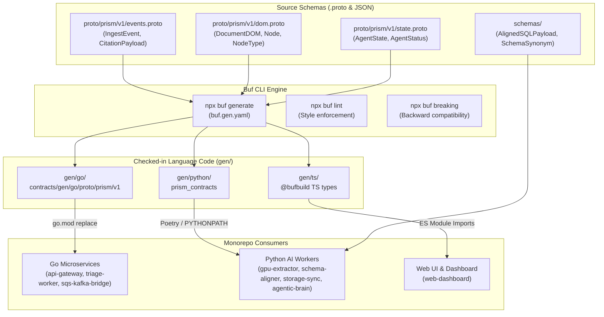

<p align="center">
  
</p>

<h1 align="center">Prism Core — Contracts Subsystem</h1>

<p align="center">
  Cross-language Protobuf specifications, type-safe generated stubs (Go, Python, TypeScript), JSON Schema sidecars, and breaking-change verification.
</p>

<p align="center">
  <a href="../../README.md">🏠 Root README</a> ·
  <a href="../../architecture.md">📐 Architecture</a> ·
  <a href="../../decisions.md">🗂 ADR Index</a> ·
  <a href="decision.md">📜 Contracts ADR</a> ·
  <a href="../../infra/README.md">🔧 Infrastructure</a>
</p>

---

## 📌 Overview

The `packages/contracts/` subsystem serves as the single source of truth for all wire formats, messaging event structures, and structured document models across the **Prism Core** monorepo. It replaces fragile string-keyed JSON dicts with strongly typed **Protocol Buffer v3** schemas.

By leveraging **Buf** for automated stub generation, changes to `.proto` definitions are continuously compiled into native code for:
* **Go Services** (`api-gateway`, `triage-worker`, `sqs-kafka-bridge`, `s3-connector`)
* **Python Services** (`gpu-extractor`, `schema-aligner`, `storage-sync`, `agentic-brain`)
* **TypeScript Clients** (`web-dashboard`)

Design rationale and architecture decision records for contracts live in [`decision.md`](./decision.md).

---

## 🏗 Schema Pipeline & Compilation Flow



---

## 🗂 File & Directory Layout

```text
packages/contracts/
├── buf.yaml                    # Buf CLI configuration (version 1, lint & breaking rules)
├── buf.gen.yaml                # Multi-language plugin generation manifest
├── decision.md                 # Contracts Architecture Decision Record (ADR)
├── README.md                   # Contracts subsystem guide (this file)
├── package.json                # Buf NPM wrapper scripts & dependency manifest
├── proto/prism/v1/             # Canonical Protocol Buffer v3 source files
│   ├── events.proto            # IngestEvent & CitationPayload message contracts
│   ├── dom.proto               # DocumentDOM, Node, Provenance, & NodeType definitions
│   └── state.proto             # AgentState & AgentStatus operational contracts
├── schemas/                    # Native JSON Schema sidecars for non-protobuf shapes
│   ├── AlignedSQLPayload.json  # Schema Aligner raw SQL payload validator
│   └── SchemaSynonym.json      # Dynamic column mapping & synonym dictionary validator
└── gen/                        # Generated type-safe code stubs (CHECKED INTO GIT)
    ├── go/                     # Go module (contracts/gen/go/proto/prism/v1)
    ├── python/                 # Python package (prism_contracts / proto/prism/v1/*_pb2.py)
    └── ts/                     # TypeScript ESM definitions
```

---

## 🔗 Consumer Matrix & Import Patterns

| Language | Target Path | Integration Mechanism | Key Application Consumers |
|---|---|---|---|
| **Go (1.21+)** | `gen/go/` | `replace contracts/gen/go => ../../packages/contracts/gen/go` in `go.mod` | `api-gateway`, `triage-worker`, `sqs-kafka-bridge` |
| **Python (3.11+)** | `gen/python/` | Poetry path dependency / `PYTHONPATH` package `prism_contracts` | `gpu-extractor`, `schema-aligner`, `storage-sync`, `agentic-brain` |
| **TypeScript (5.0+)** | `gen/ts/` | Relative ESM import from `@bufbuild/protobuf` stubs | `web-dashboard` |

---

## 📜 Core Schema Specifications

### 1. Ingestion Events (`proto/prism/v1/events.proto`)
Defines the binary payload emitted by `api-gateway` onto Kafka topic `prism.ingest.events` upon document landing in S3:

```protobuf
message IngestEvent {
  string event_id = 1;
  string tenant_id = 2;
  string s3_uri = 3;
  string file_hash_sha256 = 4;
  string timestamp = 5; // RFC3339 formatted
  map<string, string> metadata = 6;
}
```

### 2. Document DOM Tree (`proto/prism/v1/dom.proto`)
Represents visual reading order, layout bounding boxes, and node structures produced by `gpu-extractor`:

```protobuf
enum NodeType {
  NODE_TYPE_UNSPECIFIED = 0;
  NODE_TYPE_TEXT = 1;
  NODE_TYPE_TABLE = 2;
  NODE_TYPE_IMAGE = 3;
  NODE_TYPE_KEY_VALUE = 4;
  NODE_TYPE_FORM = 5;
  NODE_TYPE_SECTION_HEADER = 6;
  NODE_TYPE_TITLE = 7;
  NODE_TYPE_CHECKBOX = 8;
  NODE_TYPE_CODE = 9;
}

message Provenance {
  int32 page_number = 1;
  repeated float bounding_box = 2; // [x_min, y_min, x_max, y_max]
}

message Node {
  string id = 1;
  NodeType type = 2;
  string content = 3;
  Provenance provenance = 4;
  repeated Node children = 5;
}

message DocumentDOM {
  repeated Node nodes = 1;
  map<string, string> metadata = 2;
  string document_id = 3;
}
```

### 3. Agent Execution State (`proto/prism/v1/state.proto`)
Tracks multi-agent task execution and status lifecycle:

```protobuf
enum AgentStatus {
  AGENT_STATUS_UNSPECIFIED = 0;
  AGENT_STATUS_IDLE = 1;
  AGENT_STATUS_PROCESSING = 2;
  AGENT_STATUS_COMPLETED = 3;
  AGENT_STATUS_FAILED = 4;
}

message AgentState {
  string agent_id = 1;
  AgentStatus status = 2;
  string last_updated = 3;
  map<string, string> context = 4;
}
```

---

## ⚙️ Developer Commands & Buf Toolchain

### 1. Installation & Environment Setup

Ensure Node.js 20+ is installed. Install local dev dependencies:

```bash
cd packages/contracts
npm install
```

### 2. Regenerate Stubs Across All Languages

When modifying `.proto` files, compile updated stubs for Go, Python, and TypeScript:

```bash
npm run generate
# Equivalent to: npx buf generate
```

> [!IMPORTANT]
> **Commit Generated Stubs:** Generated files inside `gen/` **must be committed to Git**. This ensures application Dockerfiles and local development run without requiring a live Buf toolchain or internet connection during build time.

### 3. Protobuf Linting

Validate proto formatting, naming conventions, and package declarations against Buf standards:

```bash
npx buf lint
```

### 4. Breaking Change Detection

Prevent breaking schema changes (e.g. renumbering tag IDs or deleting required fields) against the main Git branch:

```bash
npx buf breaking --against '.git#branch=master'
```

---

## 🛠 Best Practices & Schema Rules

1. **Tag Number Stability:** Never renumber or reuse tag IDs in existing `.proto` messages. Mark deprecated fields as `reserved`.
2. **Backward Compatibility:** All new fields MUST be optional. Adding fields with proto3 default values ensures older workers can safely deserialize messages published by updated producers.
3. **JSON Schema Sidecars:** For payloads that remain strictly JSON-native (e.g. Schema Aligner dynamic row inserts), maintain companion Draft-07 schemas in `schemas/` rather than forcing protobuf wrappers.
