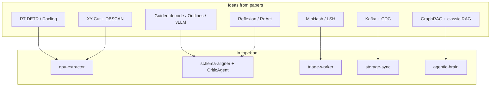

  

<h1 align="center">Research & Reading</h1>

  Papers, books, and systems studied while designing Prism Core — each mapped to something in the codebase.

  <a href="README.md">🏠 README</a> ·
  <a href="architecture.md">📐 Architecture</a> ·
  <a href="decisions.md">🗂 ADRs</a>

---

## How Papers Became Code

---

## 🖼 Layout, Reading Order & Document AI

<strong>View papers in this category</strong>

| Work | Why I read it | Where it shows up |
|---|---|---|
| **Zhao et al.** — *DETRs Beat YOLOs on Real-time Object Detection* (RT-DETR), arXiv:2304.08069, 2023 | Real-time detection without killing throughput | Layout via Docling / RT-DETR-class detectors in `gpu-extractor` |
| **Livathinos et al. / IBM Deep Search** — *Docling: An Efficient Open-Source Toolkit for AI-driven Document Conversion*, arXiv:2408.09869, 2024 | Production PDF→structure toolkit; DocLayNet lineage | Layout service + SmolDocling path |
| **Pfitzmann et al.** — *DocLayNet: A Large Human-Annotated Dataset for Document-Layout Segmentation*, DocEng 2022 | What "good layout labels" look like | Informed trusting CV layout over naive PDF scrape |
| **Ha, Haralick & Phillips** — recursive X-Y cut page segmentation (classic document analysis) | Geometric page segmentation predates transformers | My 1D Y-cluster + X-sort reading-order pass |
| **Ester et al.** — *A Density-Based Algorithm for Discovering Clusters (DBSCAN)*, KDD 1996 | Density clustering with noise | Line clustering on Y (ε ≈ 15px) without loading LayoutLM |
| **Huang et al.** — *LayoutLMv3*, arXiv:2204.08387, 2022 | Strong multimodal layout — also heavy | **Rejected** as default (VRAM); kept as fallback for scans |
| **Blecher et al.** — *Nougat: Neural Optical Understanding for Academic Documents*, arXiv:2308.13418, 2023 | End-to-end PDF→markdown | Useful baseline; weak on financial grids vs dedicated table VLMs |
| **PaddleOCR / PaddleOCR-VL** (PaddlePaddle technical reports & model cards) | Grid-aware table extraction locally | `PaddleOCR-VL-1.6` adapter + OTSL parse in bifurcation |

---

## 🧩 Constrained Generation & Small Models

<strong>View papers in this category</strong>

| Work | Why I read it | Where it shows up |
|---|---|---|
| **Willard & Louf** — *Efficient Guided Generation for Large Language Models* (Outlines), arXiv:2307.09702, 2023 | FSM / regex / JSON constrains tokens at decode time | ADR lineage for "structure isn't a prompt suggestion"; production uses vLLM guided JSON / Instructor |
| **Kwon et al.** — *Efficient Memory Management for LLM Serving with PagedAttention* (vLLM), arXiv:2309.06180, 2023 | High-throughput serving, continuous batching | Centralized vLLM; thin aligner/extractor workers |
| **OpenAI** — Structured Outputs / JSON Schema constrained decoding (2024) | Schema-faithful decode in practice | `beta.chat.completions.parse` / guided_json paths |
| **Qwen Team** — *Qwen2.5 Technical Report*, arXiv:2412.15115, 2024 | Strong open instruct models for local extraction | Default SLM target in ADRs |
| **Dettmers et al.** — *QLoRA*, arXiv:2305.14314 / NeurIPS 2023 | Cheap fine-tunes from HITL corrections | Roadmap: distill from analyst correction patches |
| **Liu et al.** — *Lost in the Middle*, arXiv:2307.03172, 2023 | Long context ≠ used context | Sliding / chunked table windows instead of stuffing whole PDFs |

---

## ⚡ Dedup, Streaming & Data Systems

<strong>View papers in this category</strong>

| Work | Why I read it | Where it shows up |
|---|---|---|
| **Broder** — *On the Resemblance and Containment of Documents*, SEQS 1997 | MinHash for near-duplicate detection | Triage near-dup / version detection story |
| **Leskovec, Rajaraman & Ullman** — *Mining of Massive Datasets* (LSH chapters) | Banding, Jaccard approximation | How I think about similarity thresholds |
| **Kreps, Narkhede & Rao** — *Kafka: a Distributed Messaging System for Log Processing*, NetDB 2011 | Durable log as integration spine | Whole pipeline |
| **Debezium / CDC literature** (Red Hat docs + "log-based CDC" pattern) | Capture DB changes without dual-write | `storage-sync` observer on extracted table events |
| **Kleppmann** — *Designing Data-Intensive Applications* (event sourcing / log chapters) | Replay, idempotency, "turn the DB inside out" | Idempotent `(document_id, node_id, row_index)` upserts |

---

## 🧠 Agents, Repair Loops & RAG

<strong>View papers in this category</strong>

| Work | Why I read it | Where it shows up |
|---|---|---|
| **Shinn et al.** — *Reflexion: Language Agents with Verbal Reinforcement Learning*, arXiv:2303.11366, 2023 | Verbal feedback → next attempt | `align_with_reflexion` + critic error reinjection |
| **Yao et al.** — *ReAct*, arXiv:2210.03629, 2023 | Reason + act loops | Generate → execute → retry in LangGraph nodes |
| **Madaan et al.** — *Self-Refine*, arXiv:2303.17651, 2023 | Iterative self-critique | Same family as critic-guided repair |
| **Edge et al.** — *From Local to Global: A GraphRAG Approach…*, arXiv:2404.16130, 2024 | Graph-structured retrieval for QA | Tri-modal brain; Neo4j + vectors |
| **Lewis et al.** — *Retrieval-Augmented Generation for Knowledge-Intensive NLP*, arXiv:2005.11401, 2020 | RAG baseline | Vector modality in Qdrant |
| **Xiao et al.** — *C-Pack / BGE embedding models*, arXiv:2309.07597, 2023 | Strong small embedders | TEI + `bge-small-en-v1.5` in compose |
| **LangGraph** (LangChain eng docs / blogs) | Durable agent graphs, checkpoints | `agentic-brain` workflow state machine |

---

## 🖥 Serving & Batching (GPU Side)

<strong>View papers in this category</strong>

| Work | Why I read it | Where it shows up |
|---|---|---|
| **Yu et al.** — *Orca: A Distributed Serving System for Transformer-Based Generative Models*, OSDI 2022 | Iteration-level continuous batching | Mental model for `DynamicBatcher` |
| **NVIDIA Triton Inference Server** docs | Decouple batching from app code | Documented scale-out path in GPU ADR |

---

## 📚 Full Citation List

<strong>View all 23 citations</strong>

1. Zhao, Y., et al. (2023). *DETRs Beat YOLOs on Real-time Object Detection* (RT-DETR). arXiv:2304.08069.
2. Livathinos, N., et al. (2024). *Docling: An Efficient Open-Source Toolkit for AI-driven Document Conversion*. arXiv:2408.09869.
3. Pfitzmann, B., et al. (2022). *DocLayNet*. ACM DocEng.
4. Ha, J., Haralick, R. M., & Phillips, I. T. Recursive X-Y cut for page segmentation (classic DA).
5. Ester, M., et al. (1996). *DBSCAN*. KDD.
6. Huang, Y., et al. (2022). *LayoutLMv3*. arXiv:2204.08387.
7. Blecher, L., et al. (2023). *Nougat*. arXiv:2308.13418.
8. Willard, B. T., & Louf, R. (2023). *Efficient Guided Generation for LLMs* (Outlines). arXiv:2307.09702.
9. Kwon, W., et al. (2023). *PagedAttention / vLLM*. arXiv:2309.06180.
10. Qwen Team (2024). *Qwen2.5 Technical Report*. arXiv:2412.15115.
11. Dettmers, T., et al. (2023). *QLoRA*. NeurIPS / arXiv:2305.14314.
12. Liu, N. F., et al. (2023). *Lost in the Middle*. arXiv:2307.03172.
13. Broder, A. Z. (1997). *On the Resemblance and Containment of Documents*.
14. Leskovec, J., Rajaraman, A., & Ullman, J. *Mining of Massive Datasets* (LSH).
15. Kreps, J., Narkhede, N., & Rao, J. (2011). *Kafka*. NetDB.
16. Kleppmann, M. *Designing Data-Intensive Applications*.
17. Shinn, N., et al. (2023). *Reflexion*. arXiv:2303.11366.
18. Yao, S., et al. (2023). *ReAct*. arXiv:2210.03629.
19. Madaan, A., et al. (2023). *Self-Refine*. arXiv:2303.17651.
20. Edge, D., et al. (2024). *GraphRAG*. arXiv:2404.16130.
21. Lewis, P., et al. (2020). *RAG*. arXiv:2005.11401.
22. Xiao, S., et al. (2023). *BGE / C-Pack*. arXiv:2309.07597.
23. Yu, G., et al. (2022). *Orca*. OSDI.

Model cards & engineering sources also referenced: PaddleOCR-VL, SmolDocling, OpenAI Structured Outputs, Debezium CDC, LangGraph docs.

